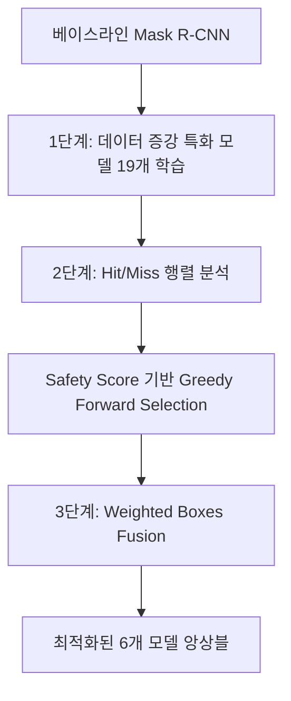

## 프로젝트 개요

일반적인 객체 탐지 아키텍처는 자동차나 보행자처럼 경계가 뚜렷하고 개별 인스턴스로 구분되는 **Things**에 최적화되어 있습니다. 반면 도로 균열이나 표면 결함처럼 대비가 낮고 텍스처로 구분되며 일정한 기하학적 형태가 없는 **Stuff**에서는 성능이 크게 떨어집니다. 이러한 복합적인 실패 현상을 **Amorphous Bottleneck**이라고 정의했습니다.

이 연구에서는 Amorphous Bottleneck을 해결하기 위한 데이터 중심의 재현율 최적화 앙상블 파이프라인을 제안합니다. 하나의 Mask R-CNN 베이스라인(ResNet-50-FPN)에서 출발해 **서로 다른 데이터 증강 기법에 특화된 모델 19개**를 학습하고 분석했습니다. 각 모델의 출력을 **Weighted Boxes Fusion(WBF)**으로 결합하고, **Greedy Forward Selection(GFS)** 알고리즘으로 최적의 **6개 모델 조합**을 선택했습니다.

## 학회 발표 및 논문 출판 현황

이 연구는 **“The Amorphous Bottleneck: A Recall Optimized Ensemble for Anomaly Detection”**라는 제목으로 **CVGAI 2026**에서 발표했습니다. 발표에서는 일반적인 객체 탐지 모델이 대비가 낮고 형태가 불규칙한 도로 결함을 잘 찾지 못하는 이유를 설명하고, 19개의 데이터 증강 특화 모델과 Greedy Forward Selection, Weighted Boxes Fusion을 결합한 데이터 중심 파이프라인을 소개했습니다. 최종 앙상블은 운영 기준 재현율을 **7.7퍼센트포인트** 높였으며, 기존 어노테이션에서 누락된 실제 결함도 찾아냈습니다.

전체 논문은 현재 **SPIE Conference Proceedings**(ISSN 0277-786X) 출판 절차가 진행 중이며, EI Compendex와 Scopus 등재가 예정되어 있습니다. [LinkedIn에서 학회 발표 게시물 보기](https://www.linkedin.com/posts/abdurakhmon-dadaboev_computervision-anomalydetection-machinelearning-activity-7477337404710756353-5TZz).

  <figure class="project-figure project-figure-wide">
    
    <figcaption>Amorphous Bottleneck은 패턴 인식, 어노테이션 일관성, 평가 단계의 실패가 결합된 문제입니다.</figcaption>
  </figure>
  <figure class="project-figure">
    
    <figcaption>CVGAI 2026에서 연구 논문을 발표하는 모습입니다.</figcaption>
  </figure>
  <figure class="project-figure">
    
    <figcaption>학회 청중에게 Things와 Stuff의 차이를 설명하는 장면입니다.</figcaption>
  </figure>

---

## 핵심 수학적 프레임워크

### 1. Weber 대비의 한계

데이터셋의 시각적 난이도를 정량화하기 위해 각 이상 객체와 주변 배경 사이의 Weber 대비 $C_w = |I_{\text{object}} - I_{\text{background}}| / I_{\text{background}}$를 계산했습니다. 전체 9,028개 인스턴스 어노테이션의 평균 Weber 대비는 **0.0824**였고, **라벨링된 결함의 95.67%가 심리물리학적 검출 임계값($C_w = 0.2$)보다 낮았습니다**. 이러한 저대비 조건에서는 사람이 표시한 경계의 일관성이 떨어져 상당한 라벨 노이즈가 발생합니다.

### 2. 비대칭 Safety Score

오탐 증가를 제한하면서 재현율을 최적화하기 위해 GFS 알고리즘은 검증 세트에서 비대칭 Safety Score $S = T_{TP} - \alpha \cdot T_{FP}$로 모델을 평가합니다. 여기서 $T_{TP}$는 참 양성 개수, $T_{FP}$는 거짓 양성 개수이며, $\alpha = 0.1$은 결함 미탐의 비용이 오탐보다 10배 크다는 조건을 반영합니다.

---

## 파이프라인과 아키텍처

### Hit/Miss 행렬 분석

평균 정밀도(Average Precision, AP)만으로는 개별 위치 추정 결과를 확인하기 어려우므로, 인스턴스 단위 **Hit/Miss 분석**을 수행했습니다. 모든 검증 이미지와 정답 바운딩 박스($IoU \ge 0.5$)에 대해 다음 항목을 추적했습니다.

- **유지된 참 양성(Retained True Positives):** 베이스라인과 특화 모델이 모두 대상을 탐지한 경우
- **복구 사례(Algorithmic Rescues):** 베이스라인이 놓친 대상을 특화 모델이 탐지한 경우
- **퇴행 사례(Algorithmic Regressions):** 베이스라인이 탐지한 대상을 특화 모델이 놓친 경우

---

## 실험 결과

홀드아웃 테스트 세트(이미지 591장, 정답 박스 1,812개)에서 사전에 확정한 6개 모델 앙상블의 출력을 $IoU = 0.55$, 신뢰도 임계값 $= 0.90$으로 결합한 결과, 다음 성능을 달성했습니다.

| 지표 | 베이스라인 | 6개 모델 앙상블 | $\Delta$ |
| :--- | :--- | :--- | :--- |
| **mAP@50:95** | 0.5420 | 0.5598 | **+0.0178** |
| **AP@50** | 0.7958 | 0.8033 | **+0.0075** |
| **운영 기준 재현율** (conf > 0.50) | 0.8317 | 0.9089 | **+0.0772** |
| **최적 F1 임계값** | 0.75 | 0.90 | **뚜렷한 이동** |

### 27:1 복구·퇴행 비율

테스트 세트의 인스턴스 분석 결과는 다음과 같습니다.

- **복구 사례 135건:** 기존에 놓친 결함을 앙상블이 탐지했습니다.
- **퇴행 사례 5건:** 기존에 탐지한 결함을 앙상블이 놓쳤습니다.

복구와 퇴행의 비율은 **27:1**이었습니다. 이는 서로 다른 데이터 증강으로 학습한 모델들이 서로 보완적인 특징을 학습했음을 보여 줍니다.

---

## 정밀도의 역설과 Ghost Detection

신뢰도 임계값 0.50에서 앙상블의 운영 기준 정밀도는 0.7125에서 0.5457로 낮아졌습니다. 원인을 확인하기 위해 어떤 정답 어노테이션과도 $IoU < 0.05$인 고신뢰도 앙상블 예측 **168건의 Ghost Detection**을 분석했습니다.

114개 이미지에 나타난 168건을 직접 검수한 결과, **정밀도의 역설**을 확인했습니다.

- “오탐”의 **95.2%(160/168)**는 실제로 존재하지만 정답 라벨링 과정에서 사람이 놓친 물리적 결함이었습니다.
- 나머지 **8/168건**만 흙, 잔해, 시멘트 패치 텍스처처럼 판단이 모호한 사례였으며, 모델이 존재하지 않는 결함을 만들어 낸 경우는 없었습니다.

이 결과는 노이즈가 있는 사람의 어노테이션보다 모델이 더 많은 실제 결함을 찾을 때도 표준 정밀도 지표가 모델을 불리하게 평가할 수 있음을 보여 줍니다. 또한 형태가 불규칙한 결함 탐지에서는 재현율을 우선하고 데이터를 면밀히 검수하는 접근이 중요하다는 점을 확인했습니다.
