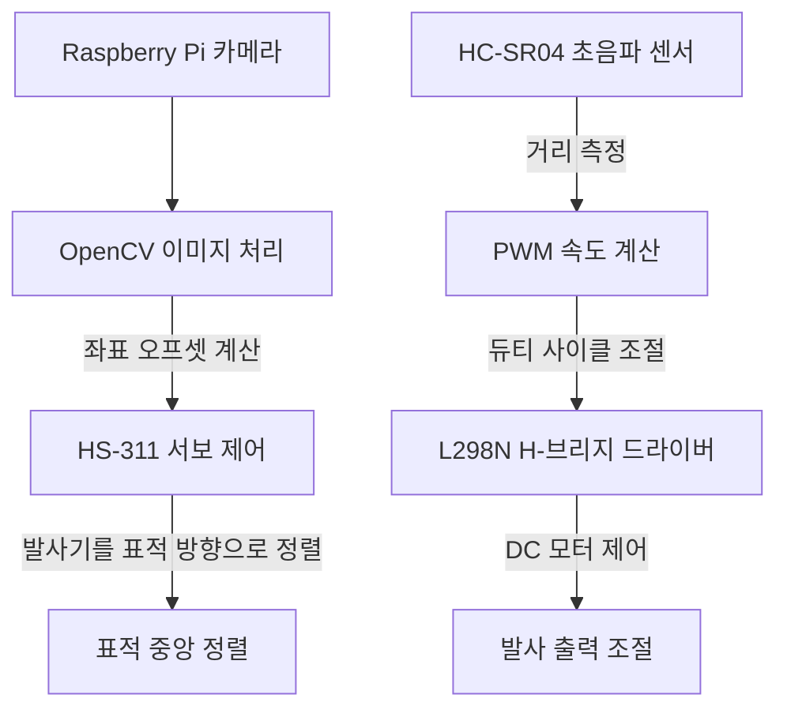

## 프로젝트 개요

일반적인 공 발사기는 사용자가 직접 조준하고 고정된 속도로 발사하기 때문에 움직이는 표적에 대응하기 어렵습니다. 이 문제를 해결하기 위해 표적을 스스로 추적하고 공을 발사하는 장치인 **Dodgeball**을 설계했습니다. 주요 전공 프로젝트로 개발한 이 시스템은 실시간 컴퓨터 비전 추적, 폐루프 서보 제어, 거리에 따른 모터 속도 조절 기능을 결합합니다.

---

## 시스템 아키텍처

시스템은 두 개의 제어 루프로 구성됩니다.

1. **표적 추적 루프:** Raspberry Pi 카메라가 빨간색 구형 표적의 좌표를 추적합니다. 프레임 중심과 표적 사이의 좌표 오차를 바탕으로 고토크 표준 서보모터를 제어해 발사대의 수평 방향을 조정합니다.
2. **발사 출력 제어 루프:** 초음파 센서가 표적까지의 실제 거리를 측정합니다. 사용자 정의 매핑 함수가 거리를 펄스 폭 변조(PWM) 듀티 사이클로 변환하고, L298N H-브리지를 통해 두 개의 DC 발사 모터를 제어합니다.

### 회로도

아래 회로도는 Raspberry Pi, 표준 서보모터, L298N 모터 드라이버, 센서 사이의 연결을 보여 줍니다.

---

## 주요 구현 내용

### 1. OpenCV 기반의 안정적인 표적 분리

초기에는 RGB 임계값으로 표적을 분리했지만, 실내 조명이 바뀌면 반사광과 그림자가 색상 분류를 방해해 안정적으로 작동하지 않았습니다. 이를 해결하기 위해 이미지 처리 파이프라인을 **HSV(Hue, Saturation, Value) 색 공간**으로 전환했습니다. 순수한 색상 정보를 나타내는 Hue 채널에 명확한 범위를 적용해 배경 노이즈를 필터링하고 빨간색 표적의 정확한 중심점을 추출합니다.

- **중심점 계산:** 컨투어 모멘트를 계산해 표적 중심의 $(x, y)$ 좌표를 구합니다.
- **오차 보정:** 표적 중심과 카메라 프레임 중심을 비교합니다. 오프셋이 $\pm 30$픽셀의 데드 밴드를 벗어나면 서보모터에 PWM 증분 명령을 보내 발사대를 회전시키고 표적을 다시 중앙에 맞춥니다.

### 2. 구간별 선형 발사 출력 보간

DC 모터의 기동 임계값과 기계적 저항 때문에 전압과 발사 거리의 관계는 선형적이지 않습니다. 50cm에서 210cm까지의 유효 발사 범위에서 안정적으로 명중시키기 위해 구간별 선형 매핑 함수를 설계했습니다. Raspberry Pi가 HC-SR04 센서에서 거리를 읽고 적절한 PWM 듀티 사이클을 보간합니다.

- 50cm 미만: DC 모터를 낮은 기본 듀티 사이클로 유지합니다.
- 50cm 이상 210cm 이하: $\text{Duty} = 10\% + (\text{Distance} - 50) \times 0.05\%$ 식으로 듀티 사이클을 동적으로 조절합니다.
- 210cm 초과: 모터를 최대 출력으로 구동합니다.

---

## 기술적 문제와 해결 방법

1. **전원 공급 불안정:** Raspberry Pi, 두 개의 발사용 DC 모터, 위치 제어용 서보모터를 하나의 배터리 팩으로 동시에 구동하면 전압 강하가 발생해 마이크로컨트롤러가 재시작되었습니다.
   - *해결:* 고전류 12V DC 전원 어댑터를 사용하는 분리형 전원 레일을 설계하고, 제어 로직과 고전류 모터에 각각 별도의 전압 레귤레이터를 적용했습니다.
2. **플랫폼 균형 문제:** 무거운 카메라 마운트와 모터가 중심에서 벗어나 있어 추적 플랫폼이 기울고 서보모터가 정지하는 문제가 있었습니다.
   - *해결:* 구조 부품을 가벼운 아크릴 판으로 다시 제작하고, 서보모터의 주 회전축을 중심으로 무게를 배치해 토크 부하를 줄였습니다.
3. **서보모터 지연 튜닝:** 서보모터의 위치를 급격히 바꾸면 진동이 발생하고 카메라 영상이 흐려졌습니다.
   - *해결:* 제어 루프에 짧은 안정화 지연을 추가해 다음 프레임을 촬영하기 전에 서보모터가 안정되도록 했습니다.

---

## 시연 영상

아래 영상은 Dodgeball 발사기가 실시간으로 표적을 추적하고 공을 발사하는 하드웨어 테스트 장면입니다.

  <iframe
    src="https://www.youtube.com/embed/RzG0mym6OIU"
    title="Dodgeball 자율 공 발사기 테스트 영상"
    frameborder="0"
    allow="accelerometer; autoplay; clipboard-write; encrypted-media; gyroscope; picture-in-picture; web-share"
    allowfullscreen
    style="position: absolute; top: 0; left: 0; width: 100%; height: 100%;"
  ></iframe>

