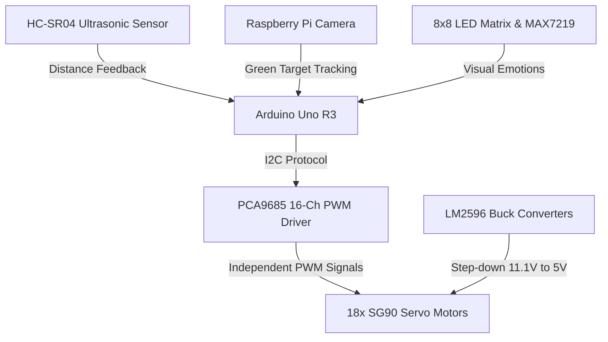

## Overview

Unlike wheeled systems, legged robots can navigate highly uneven terrain and step over obstacles. However, coordinating multiple limbs requires high-precision motor control, stable kinematics, and efficient power management. 

This Capstone Design project presents the development of an **autonomous 18-Degree-of-Freedom (DOF) hexapod spider robot**. Built using custom 3D-printed chassis components, an Arduino Uno R3, and a dedicated PCA9685 PWM driver, the robot executes stable walking gaits, performs real-time obstacle avoidance, and integrates computer vision target tracking.

---

## System Architecture

The robot is engineered around a distributed hardware control layout:
- **Kinematics Engine**: An Arduino Uno R3 handles gait generation and sensor polling, communicating with a PCA9685 I2C servo driver to control 18 SG90 micro servos (3 joints per leg: shoulder, femur, and tibia).
- **Sensory Perception**: Uses an HC-SR04 ultrasonic sensor for autonomous navigation and obstacle avoidance. A companion Raspberry Pi camera module tracks a green color marker to follow the owner.
- **Human-Robot Interface (HRI)**: An 8x8 LED matrix driven by a MAX7219 controller displays expressive pixel patterns (e.g., happy, sad, scanning) based on the robot's operational state.

### Circuit Schematic
Below is the circuit schematic showing the power distribution loops, the PCA9685 servo driver connections to the 18 servos, and the interface with the Arduino Uno:

---

## Key Implementation Details

### 1. Tripod Gait Locomotion State Machine
Coordinating 18 independent joints to walk requires active balance. We implemented a **tripod gait** kinematics scheme where the legs are divided into two alternating sets of three (Legs 1-3-5 and Legs 2-4-6).
- **Swing and Stance Phase**: While one tripod set lifts and swings forward (swing phase), the other tripod set remains firmly on the ground, pushing the robot forward (stance phase). This configuration ensures the robot's center of mass always remains within the stable triangular support base.
- **Memory Optimization**: Storing high-dimensional gait trajectory arrays on the Arduino Uno's limited SRAM (2 KB) caused stack overflows. We optimized the firmware by moving static gait angle tables into flash memory using the `PROGMEM` macro.

### 2. High-Current Power Circuit Design
SG90 micro servos draw low average currents but experience severe current spikes (up to 800 mA each) during simultaneous startup or leg lifting. With 18 servos active, the total peak current requirement can exceed 10 A, which easily damages standard voltage regulators.
- **Buck Regulation**: We designed a custom power distribution board utilizing high-current LM2596 DC-DC buck converters. It steps down an 11.1V LiPo battery supply to a regulated 5V, delivering up to 3A of continuous current per board segment to prevent voltage drops.
- **Decoupling Capacitors**: Added high-capacity electrolytic capacitors across the servo power rails to buffer current spikes and prevent microcontroller resets.

---

## Technical Challenges & Solutions

1. **Servo Driver Overheating**: Early tests using miniature buck converters resulted in thermal shutdown due to current overload from joint friction.
   - *Solution*: Upgraded to heavy-duty LM2596 converters, distributed the load across separate power lines, and added heat sinks to the driver chips.
2. **Leg Slippage on Smooth Surfaces**: The raw 3D-printed plastic leg tips had a low coefficient of friction, causing the robot to slip and drift during turns.
   - *Solution*: Designed and fitted custom rubberized grip tips to the ends of the tibias, providing the friction necessary for precise movement.
3. **PCA9685 Pin Burnout**: During wiring modifications, back-EMF from the servos caused reverse voltage spikes, blowing out the driver pins.
   - *Solution*: Added P-channel MOSFET switches to the power inputs, providing over-current and reverse-polarity protection to the PCA9685 board.

---

## Demonstration Video

Below is the hardware test demonstration of the 18-DOF Hexapod robot walking, displaying emotions, and tracking green markers:

  <iframe 
    src="https://www.youtube.com/embed/ncwSMs6z5Ug" 
    title="18-DOF Hexapod Spider Robot Test Video" 
    frameborder="0" 
    allow="accelerometer; autoplay; clipboard-write; encrypted-media; gyroscope; picture-in-picture; web-share" 
    allowfullscreen 
    style="position: absolute; top: 0; left: 0; width: 100%; height: 100%;"
  ></iframe>

