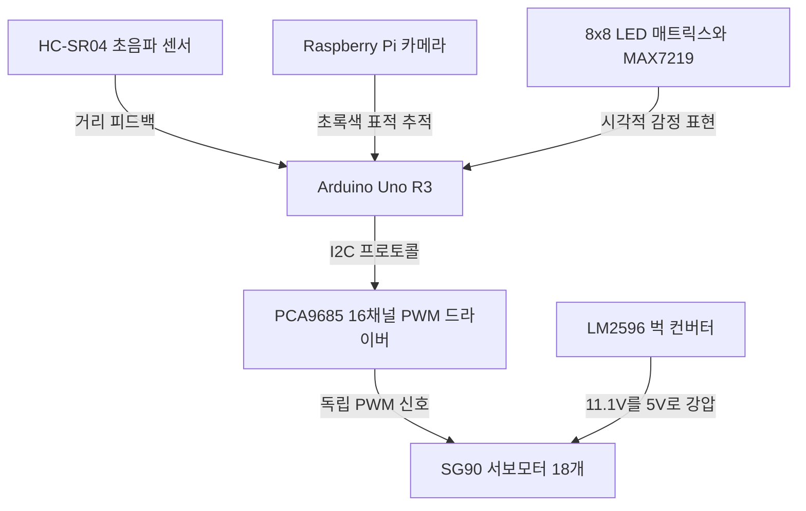

## 프로젝트 개요

바퀴형 시스템과 달리 보행 로봇은 고르지 않은 지형을 이동하고 장애물을 넘어갈 수 있습니다. 하지만 여러 다리를 함께 움직이려면 정밀한 모터 제어, 안정적인 운동학, 효율적인 전력 관리가 필요합니다.

이 캡스톤 디자인 프로젝트에서는 **자율 보행이 가능한 18자유도(DOF) 헥사포드 로봇**을 개발했습니다. 직접 설계하고 3D 프린팅한 섀시 부품, Arduino Uno R3, PCA9685 PWM 드라이버를 사용했으며, 안정적인 보행, 실시간 장애물 회피, 컴퓨터 비전 기반 표적 추적 기능을 구현했습니다.

---

## 시스템 아키텍처

```mermaid
graph TD
    A[Arduino Uno R3] -->|I2C 프로토콜| B[PCA9685 16채널 PWM 드라이버]
    B -->|독립 PWM 신호| C[SG90 서보모터 18개]
    D[HC-SR04 초음파 센서] -->|거리 피드백| A
    E[Raspberry Pi 카메라] -->|초록색 표적 추적| A
    F[LM2596 벅 컨버터] -->|11.1V를 5V로 강압| C
    G[8x8 LED 매트릭스와 MAX7219] -->|시각적 감정 표현| A
```

로봇은 다음과 같은 하드웨어 제어 구조로 설계했습니다.

- **운동학 엔진:** Arduino Uno R3가 보행 패턴 생성과 센서 폴링을 담당합니다. PCA9685 I2C 서보 드라이버와 통신해 SG90 마이크로 서보모터 18개를 제어하며, 각 다리에는 shoulder, femur, tibia 서보가 하나씩 배치됩니다.
- **환경 인식:** HC-SR04 초음파 센서를 자율 이동 중 장애물 감지와 회피에 사용합니다. Raspberry Pi 카메라 모듈은 초록색 마커를 추적해 사용자를 따라가도록 합니다.
- **인간·로봇 인터페이스(HRI):** MAX7219 컨트롤러로 구동되는 8x8 LED 매트릭스가 로봇의 작동 상태에 따라 기쁨, 슬픔, 탐색 등의 픽셀 패턴을 표시합니다.

### 회로도

아래 회로도는 전력 분배 경로, PCA9685 서보 드라이버와 18개 서보모터의 연결, Arduino Uno 인터페이스를 보여 줍니다.

---

## 주요 구현 내용

### 1. 트라이포드 보행 상태 머신

18개의 관절을 협응해 안정적으로 걷게 하려면 정밀한 보행 순서와 자세 제어가 필요합니다. 다리를 1·3·5번과 2·4·6번의 두 그룹으로 나눠 번갈아 움직이는 **트라이포드 보행(tripod gait) 상태 머신**을 구현했습니다.

- **유각기와 입각기:** 한쪽 세 다리가 들려 앞으로 이동하는 유각기(swing phase) 동안, 다른 세 다리는 지면을 지지하며 로봇을 앞으로 미는 입각기(stance phase)를 수행합니다. 이 구조는 로봇의 무게중심을 안정적인 삼각 지지 영역 안에 유지합니다.
- **메모리 최적화:** Arduino Uno의 제한된 SRAM(2KB)에 고차원 보행 궤적 배열을 저장하면 스택 오버플로가 발생했습니다. 정적인 관절 각도 테이블을 `PROGMEM` 매크로를 사용해 플래시 메모리로 옮겨 펌웨어를 최적화했습니다.

### 2. 고전류 전원 회로 설계

SG90 마이크로 서보모터는 평균 소비 전류가 낮지만, 동시에 기동하거나 다리를 들어 올릴 때 각각 최대 800mA의 순간 전류가 발생할 수 있습니다. 18개가 함께 작동하면 최대 전류가 10A를 넘어 일반 전압 레귤레이터가 손상될 수 있습니다.

- **벅 컨버터 기반 강압:** 고전류 LM2596 DC-DC 벅 컨버터를 사용한 전력 분배 보드를 설계했습니다. 11.1V LiPo 배터리 전압을 안정적인 5V로 낮추고, 보드 구간별로 최대 3A의 연속 전류를 공급해 전압 강하를 방지했습니다.
- **디커플링 커패시터:** 서보모터 전원 레일에 대용량 전해 커패시터를 추가해 순간적인 전압 강하를 완화하고 마이크로컨트롤러 리셋을 방지했습니다.

---

## 기술적 문제와 해결 방법

1. **서보 드라이버 과열:** 초기 테스트에서 소형 벅 컨버터가 관절 마찰로 인한 과전류를 견디지 못해 과열로 셧다운이 발생했습니다.
   - *해결:* 고용량 LM2596 컨버터로 교체하고, 부하를 여러 전원 라인으로 분산했으며, 드라이버 칩에 방열판을 추가했습니다.
2. **매끄러운 표면에서의 다리 미끄러짐:** 3D 프린팅한 플라스틱 다리 끝의 마찰계수가 낮아 회전할 때 로봇이 미끄러지고 경로에서 벗어났습니다.
   - *해결:* 다리 끝에 장착할 고무 그립을 직접 설계해 정밀한 이동에 필요한 마찰력을 확보했습니다.
3. **PCA9685 핀 손상:** 배선을 수정하는 과정에서 서보모터의 역기전력(back-EMF)이 역전압 스파이크를 일으켜 드라이버 핀이 손상되었습니다.
   - *해결:* 전원 입력부에 P채널 MOSFET 스위치를 추가해 PCA9685 보드를 과전류와 역극성으로부터 보호했습니다.

---

## 시연 영상

아래 영상은 18자유도 헥사포드 로봇의 보행, LED 감정 표현, 초록색 마커 추적 기능을 테스트한 모습입니다.

  <iframe
    src="https://www.youtube.com/embed/ncwSMs6z5Ug"
    title="18자유도 헥사포드 로봇 테스트 영상"
    frameborder="0"
    allow="accelerometer; autoplay; clipboard-write; encrypted-media; gyroscope; picture-in-picture; web-share"
    allowfullscreen
    style="position: absolute; top: 0; left: 0; width: 100%; height: 100%;"
  ></iframe>

