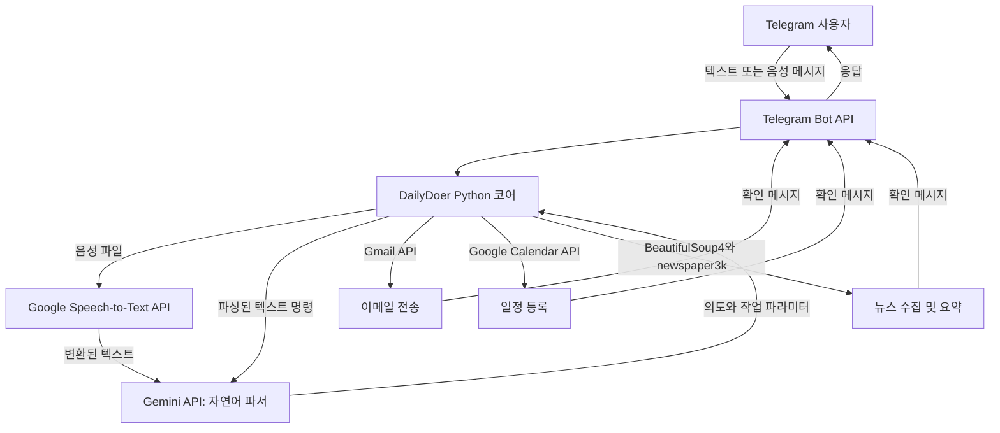

## 프로젝트 개요

일정 관리, 이메일 작성, 뉴스 확인을 서로 다른 탭에서 처리하면 많은 시간이 듭니다. **DailyDoer Agent**는 이러한 작업을 하나의 채팅 창에서 수행하도록 만든 대화형 Telegram 어시스턴트입니다.

Google Gemini API를 활용해 텍스트와 음성 메시지 형태의 자연어를 이해하고, 일정 등록, 이메일 전송, 음성 인식, 웹 기사 요약 등의 작업을 실행합니다.

---

## 시스템 아키텍처

---

## 핵심 기능과 연동

### 1. 자연어 의도 파싱

- **Google Gemini(`gemini-1.5-flash-latest`)**를 활용한 제로샷 의도 분류 방식으로 작동합니다. “내일 오후 2시에 팀 동기화 회의를 잡아 줘”와 같은 일상적인 문장을 대상 이메일 주소, 날짜, 일정 설명이 포함된 구조화된 API 호출로 변환합니다.

### 2. 음성 명령 변환

- `google-cloud-speech`를 통해 **Google Cloud Speech-to-Text API**와 연동하여 음성 메시지를 실시간으로 텍스트로 변환합니다. 변환된 명령은 자연어 이해 엔진으로 바로 전달되어 사용자가 손을 쓰지 않고도 시스템을 조작할 수 있습니다.

### 3. Google Workspace 자동화

- **일정 관리:** **Google Calendar API**로 일정을 조회하고, 시간 충돌을 확인하며, 시작 및 종료 시간이 지정된 새 일정을 등록합니다.
- **이메일 연동:** **Gmail API**와 안전한 OAuth 2.0 인증 흐름(`credentials.json`, `token.json`)을 사용해 인증된 Gmail 계정에서 이메일을 작성하고 전송합니다.

### 4. 뉴스 수집 및 요약

- **`newspaper3k`**와 **`httpx`**를 사용해 사용자가 제공한 URL에서 본문을 추출하고 요약합니다.
- BeautifulSoup4 기반의 자동 홈페이지 스크레이퍼가 미리 설정한 뉴스 홈페이지에서 기사 링크를 추출하고, Gemini로 내용을 요약한 뒤 간결한 일일 브리핑을 사용자에게 전달합니다.

---

## 기술적 문제와 해결 방법

1. **웹 스크래핑의 안정성 문제:** 뉴스 사이트의 정적 HTML 구조가 자주 바뀌어 BeautifulSoup4 CSS 셀렉터가 동작하지 않는 문제가 있었습니다.
   - *해결:* 본문 추출에는 변경에 더 강한 `newspaper3k`의 휴리스틱을 사용하고, BeautifulSoup4는 뉴스 사이트에서 기사 링크만 수집하는 용도로 제한했습니다.
2. **안전한 토큰 수명 주기 관리:** Gmail과 Google Calendar의 액세스 토큰을 관리하면서 매번 사용자가 다시 인증하지 않도록 해야 했습니다.
   - *해결:* 로컬 토큰 저장소(`token.json`)를 구현해 토큰을 자동으로 갱신하고, 토큰이 만료되거나 취소된 경우에만 사용자 재인증을 요청하도록 했습니다.

---

## GitHub 저장소

전체 설치 방법, 인증 정보 설정 안내, Python 소스 코드는 GitHub에서 확인할 수 있습니다.

👉 [AlexL71/Daily-Doer---Agent](https://github.com/AlexL71/Daily-Doer---Agent)
