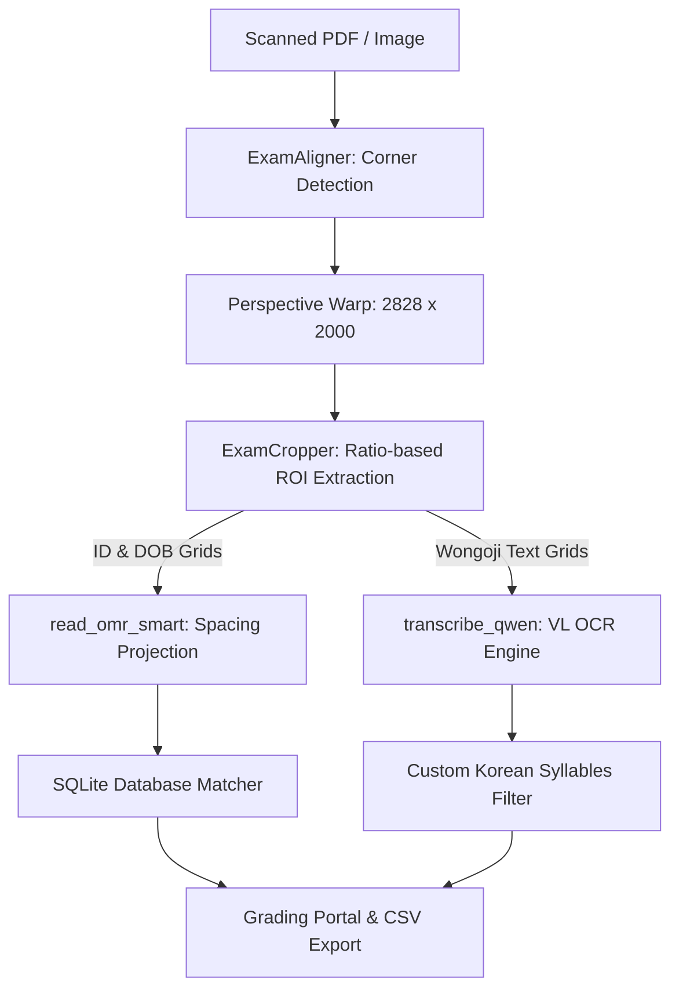

## Overview

Digitizing handwritten exams presents dual engineering challenges: high-precision Optical Mark Recognition (OMR) is required to map student IDs and dates of birth, alongside robust Handwritten Text Recognition (HTR) to transcribe paragraphs written on traditional Korean *Wongoji* grid layouts.

**ExamOCR** is an end-to-end processing pipeline built to solve this. It combines high-speed perspective alignment, projection-based grid cropping, and VL-based sequence modeling (Qwen2.5-VL-7B-Instruct) inside a Streamlit administration portal.

---

## System Architecture



The application is structured into modular layers:
1.  **Frontend Interface**: Streamlit-based web dashboard supporting multilingual grading, canvas annotations, and CSV records exports.
2.  **Storage Engine**: SQLite database (`database.py`) maintaining student identity tables, grades, canvas states, and text transcriptions.
3.  **Visual Alignment & Cropping**: Alignment algorithms (`utils/alignment.py`) and ratio-based croppers (`utils/cropping.py`).
4.  **OMR Cell Profiler**: Timing-track projection engines (`utils/detection.py`).
5.  **HTR Transcription**: GPU-accelerated Qwen2.5-VL sequence generation (`utils/recognition.py`).

---

## Engineering Pivot: Deterministic Alignment vs. Contour Markers

Early prototypes attempted to locate fields and checkboxes by finding individual bounding box contours. This failed in production because pencil markings, handwriting overlaps, and page folds frequently corrupted the contour boundaries, causing alignment drifts.

The system was re-engineered around a **Deterministic Alignment & Projection Pipeline**:

### 1. Corner Marker Perspective Warping
Instead of detecting local form fields directly, the system locates four solid black square/rectangle corner markers placed in the sheet's margins.
- **Marker Detection**: Checks local quadrants (`0:cy, 0:cx`, etc.) using contour area constraints ($50 < \text{Area} < 5000$) and strict aspect ratio boundaries (width-to-height ratio between $0.7$ and $1.3$).

- **Warping**: Maps the four detected coordinates to a deterministic target resolution ($2828 \times 2000$ pixels) using a perspective warp matrix:

```python
src = np.array([tl, tr, br, bl], dtype="float32")
dst = np.array([[0, 0], [temp_w, 0], [temp_w, temp_h], [0, temp_h]], dtype="float32")
warped = cv2.warpPerspective(img, cv2.getPerspectiveTransform(src, dst), (temp_w, temp_h))
```

### 2. Predefined Ratio Cropping
Once the canvas is normalized, the regions of interest (ROIs) are extracted using fixed coordinate percentages, bypassing dynamic contour detection entirely:
```python
ROIS_P1 = {
    'Student_ID':    {'x': (0.202, 0.518),   'y': (0.0534, 0.2051)},
    'DOB':           {'x': (0.5265, 0.719),  'y': (0.0537, 0.2044)},
    'Name':          {'x': (0.7285, 0.993),  'y': (0.0127, 0.0566)},
    'Wongoji_P1':    {'x': (0.0095, 0.993),  'y': (0.2207, 0.976)}
}
```

### 3. Timing-Track Projection OMR
To parse filled cells in the Student ID and DOB grids, `read_omr_smart` computes vertical and horizontal projections of binary pixel densities (sum of active pixels along each axis). The column and row cell boundaries are located by identifying peaks and valleys in the projection distributions, acting as dynamic **timing tracks**.
- **Mark Classification**: The red channel ($I_R$) is thresholded to isolate pencil strokes from the red grid lines. The fill ratio of each cell is calculated:

$$
\text{Ratio} = \frac{\text{NonZero}(I_R \le 180)}{\text{Cell Area}}
$$

If a cell's fill ratio is $\ge 12\%$, it is marked as a selection; ratios between $5\%$ and $12\%$ are flagged as "doubtful" (`!`), triggering human review.

---

## Custom Korean Syllables Filter

Handwritten HTR transcriptions are prone to noise from grid borders, leading the visual language model (Qwen2.5-VL) to occasionally output invalid character structures. 

To resolve this, we engineered a post-processing **Korean Linguistic Filter**.
Mathematically, a Hangul syllable is formed by combining Choseong (initial consonant), Jungseong (medial vowel), and Jongseong (optional final consonant), yielding 11,172 possible combinations in the Unicode Hangul Syllables block (`U+AC00` to `U+D7A3`). However, only **2,350 syllables** are linguistically valid and commonly used in standard Korean (standardized under **KS X 1001**).

The filter processes the OCR sequence:
1. Iterates over each transcribed character.
2. Checks if the character falls within the Hangul Syllables block.
3. If yes, verifies if the character is a member of the **2,350 KS X 1001 character classes**.
4. Syllables that represent non-existent or linguistically invalid combinations are stripped or mapped to nearest phonetic matches, preventing typographical artifacts from corrupting downstream database indexing.
5. Employs Kiwi (`kiwipiepy`) morphological analysis to extract valid noun tokens (`NNG`, `NNP`) for metadata indexing.
