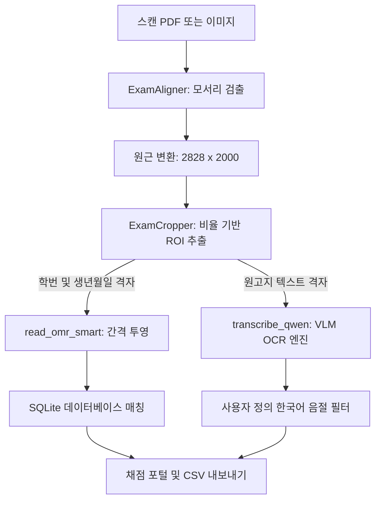

## 프로젝트 개요

손글씨 시험지를 디지털화하려면 두 가지 기술적 문제를 함께 해결해야 합니다. 학번과 생년월일을 정확히 읽기 위한 광학 마크 인식(OMR)과, 전통적인 한국어 원고지에 작성된 문장을 텍스트로 옮기기 위한 안정적인 필기체 텍스트 인식(HTR)이 필요합니다.

**ExamOCR**은 이를 해결하기 위해 개발한 엔드투엔드 처리 파이프라인입니다. 원근 왜곡 보정, 투영 기반 격자 크로핑, Qwen2.5-VL-7B-Instruct 기반 텍스트 인식을 Streamlit 관리 포털에 통합했습니다.

---

## 시스템 아키텍처


```mermaid
graph TD
    A[스캔 PDF 또는 이미지] --> B[ExamAligner: 모서리 검출]
    B --> C[원근 변환: 2828 x 2000]
    C --> D[ExamCropper: 비율 기반 ROI 추출]
    D -->|학번 및 생년월일 격자| E[read_omr_smart: 간격 투영]
    D -->|원고지 텍스트 격자| F[transcribe_qwen: VLM OCR 엔진]
    E --> G[SQLite 데이터베이스 매칭]
    F --> H[사용자 정의 한국어 음절 필터]
    G & H --> I[채점 포털 및 CSV 내보내기]
```

애플리케이션은 다음과 같은 모듈 계층으로 구성됩니다.

1. **프런트엔드 인터페이스:** 다국어 채점, 캔버스 어노테이션, CSV 기록 내보내기를 지원하는 Streamlit 기반 웹 대시보드입니다.
2. **저장 엔진:** 학생 식별 정보, 성적, 캔버스 상태, 텍스트 인식 결과를 관리하는 SQLite 데이터베이스(`database.py`)입니다.
3. **영상 정렬 및 크로핑:** 정렬 알고리즘(`utils/alignment.py`)과 비율 기반 크로퍼(`utils/cropping.py`)입니다.
4. **OMR 셀 프로파일러:** 타이밍 트랙 투영 엔진(`utils/detection.py`)입니다.
5. **HTR 텍스트 변환:** GPU 가속 Qwen2.5-VL 시퀀스 생성 모듈(`utils/recognition.py`)입니다.

---

## 설계 전환: 컨투어 마커에서 결정론적 정렬로

초기 프로토타입에서는 각 바운딩 박스의 컨투어를 찾아 입력란과 체크박스의 위치를 검출했습니다. 하지만 실제 시험지에서는 연필 표시, 겹쳐 쓴 글씨, 접힌 자국이 컨투어 경계를 자주 훼손해 정렬 오차가 발생했습니다.

이에 따라 시스템을 **결정론적 정렬 및 투영 파이프라인** 중심으로 다시 설계했습니다.

### 1. 모서리 마커 기반 원근 변환

개별 입력란을 직접 검출하는 대신 시험지 가장자리에 배치된 검은색 정사각형 또는 직사각형 모서리 마커 네 개를 찾습니다.

- **마커 검출:** 이미지의 네 모서리 영역(`0:cy, 0:cx` 등)에서 컨투어 면적 조건($50 < \text{Area} < 5000$)과 엄격한 종횡비 범위(가로·세로 비율 $0.7$에서 $1.3$ 사이)를 확인합니다.
- **원근 변환:** 검출된 네 좌표를 원근 변환 행렬로 고정된 목표 해상도($2828 \times 2000$픽셀)에 매핑합니다.

```python
src = np.array([tl, tr, br, bl], dtype="float32")
dst = np.array([[0, 0], [temp_w, 0], [temp_w, temp_h], [0, temp_h]], dtype="float32")
warped = cv2.warpPerspective(img, cv2.getPerspectiveTransform(src, dst), (temp_w, temp_h))
```

### 2. 사전 정의된 비율 기반 크로핑

캔버스를 정규화한 뒤 고정된 좌표 비율로 관심 영역(ROI)을 추출합니다. 이 방식은 동적인 컨투어 검출을 사용하지 않습니다.

```python
ROIS_P1 = {
    'Student_ID':    {'x': (0.202, 0.518),   'y': (0.0534, 0.2051)},
    'DOB':           {'x': (0.5265, 0.719),  'y': (0.0537, 0.2044)},
    'Name':          {'x': (0.7285, 0.993),  'y': (0.0127, 0.0566)},
    'Wongoji_P1':    {'x': (0.0095, 0.993),  'y': (0.2207, 0.976)}
}
```

### 3. 타이밍 트랙 투영 기반 OMR

`read_omr_smart`는 학번과 생년월일 격자의 마킹 셀을 읽기 위해 이진화 영상의 수직·수평 픽셀 밀도 투영, 즉 각 축을 따라 활성 픽셀을 합산한 값을 계산합니다. 투영 분포의 피크와 골을 통해 열과 행의 셀 경계를 동적으로 찾아 **타이밍 트랙(timing tracks)**으로 사용합니다.

- **마킹 분류:** 빨간색 격자선과 연필 자국을 분리하기 위해 빨간색 채널($I_R$)에 임계값을 적용합니다. 각 셀의 채움 비율은 다음과 같이 계산합니다.

$$
\text{Ratio} = \frac{\text{NonZero}(I_R \le 180)}{\text{Cell Area}}
$$

채움 비율이 $\ge 12\%$이면 선택된 셀로 판정합니다. $5\%$ 이상 $12\%$ 미만이면 “확인 필요”(`!`)로 표시해 사람이 검수하도록 합니다.

---

## 사용자 정의 한국어 음절 필터

필기 HTR 결과에는 격자 경계로 인한 노이즈가 섞일 수 있으며, 이 때문에 비전 언어 모델(VLM)인 Qwen2.5-VL이 유효하지 않은 글자 조합을 출력하기도 합니다.

이를 줄이기 위해 후처리용 **한국어 언어 필터**를 구현했습니다. 한글 음절은 초성, 중성, 선택적인 종성을 조합해 만들어지며, Unicode 한글 음절 영역(`U+AC00`부터 `U+D7A3`)에는 11,172개의 조합이 있습니다. 이 중 표준 한국어에서 널리 쓰이는 **2,350자**는 **KS X 1001**로 정의되어 있습니다.

필터는 OCR 시퀀스를 다음과 같이 처리합니다.

1. 인식된 문자를 하나씩 순회합니다.
2. 문자가 Unicode 한글 음절 영역에 속하는지 확인합니다.
3. 한글 음절이면 **KS X 1001의 2,350자 집합**에 포함되는지 확인합니다.
4. 집합에 없는 조합은 제거하거나 음운적으로 가장 가까운 문자로 매핑해 잘못된 문자가 데이터베이스 인덱싱에 영향을 주지 않도록 합니다.
5. Kiwi(`kiwipiepy`) 형태소 분석기로 유효한 일반 명사(`NNG`)와 고유 명사(`NNP`) 토큰을 추출해 메타데이터 인덱싱에 사용합니다.
