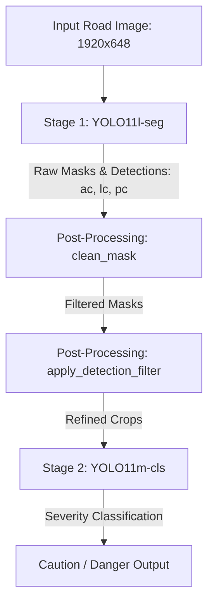

## Overview

Automated monitoring of civil infrastructure requires highly robust computer vision systems. Pavement anomalies like alligator cracks and longitudinal cracks have irregular, non-rigid geometries that cannot be accurately represented by rectangular bounding boxes. Traditional detection systems face high rates of false positives and poor boundary precision.

This case study presents the design, implementation, and empirical evaluation of the **Road Damage Segmentation AI Vision Model v1.0**, developed for TQS Korea Co., Ltd. The system was awarded official certification (Test Report No. **TWR-202512-A-0072**) by the third-party testing agency **AIWORKS Co., Ltd.**, meeting all stringent precision, recall, and segmentation quality criteria.

---

## Official AIWORKS Certification

The model was subjected to a rigorous evaluation period between December 4 and December 17, 2025. Evaluating against official test sets, the model passed all certified threshold criteria:

| Evaluation Metric | Target Threshold | Certified Result | Status |
|---|---|---|---|
| Detection Accuracy (mAP@50) | $\ge 0.85$ | 0.88 | PASS |
| Segmentation Quality (mIoU) | $\ge 0.70$ | 0.79 | PASS |
| Recall Rate | $\ge 0.90$ | 0.91 | PASS |

---

## Two-Stage Architecture & Pipeline

Rather than relying on a single end-to-end network, the system separates pixel-level mask segmentation from severity classification. This decoupled design limits error propagation and ensures that classification heads only process regions of interest containing verified damage.

### Stage 1: Instance Segmentation & Anomaly Localization
The first stage takes cropped road images resized to $1920 \times 648$ (pre-processed to exclude non-road areas such as sky, sidewalks, and surrounding scenery). A **YOLO11l-seg** architecture is trained to predict instance masks for three primary defect classes:
- **Alligator Crack (`ac`)**
- **Longitudinal Crack (`lc`)**
- **Repair Patch (`pc`)**

### Stage 2: Post-Processing & Filtering
To eliminate noisy detections and boundary tendrils common in low-contrast asphalt, the segmentation masks are processed via a two-stage filter:

1. **Morphological Cleanup (`clean_mask`)**: 
   We apply morphological opening (erosion followed by dilation) with a structured kernel to suppress small floating blobs and thin, disconnected tendrils, retaining only the largest connected component of the binary mask.

2. **Containment & Overlap Suppression (`apply_detection_filter`)**:
   We implement a geometric rule-based filter using Intersection over Union (IoU) to resolve overlapping detections. For instance, if an alligator crack mask ($M_{ac}$) and a longitudinal crack mask ($M_{lc}$) overlap significantly, we suppress the weaker classification, preventing double-counting and boundary dilution.

### Stage 3: Severity Classification
Once the refined masks are established, the bounding boxes of the detected `ac` and `lc` instances are cropped from the original image. These crops are fed to class-specific **YOLO11m-cls** classification networks to grade severity into **Caution** or **Danger**:
- **Alligator Crack (`ac`) Severity**: Evaluated on 5,120 test instances (`ac_caution`: 3,293; `ac_danger`: 1,827). Achieved **0.879 Accuracy** and **0.866 F1-Score**.
- **Longitudinal Crack (`lc`) Severity**: Evaluated on 3,048 test instances (`lc_caution`: 2,651; `lc_danger`: 397). Achieved **0.956 Accuracy** and **0.959 F1-Score**.

---

## Detailed Performance Analysis

The overall model evaluation was completed across 2,083 validation instances. Below are the class-specific metrics from our empirical evaluation:

| Target Class | Test Instances | mAP@50 | mIoU | Recall | Missed Rate |
| :--- | :--- | :--- | :--- | :--- | :--- |
| **Alligator Crack (`ac`)** | 1,022 | 0.912 | 0.801 | 0.950 | 4.99% |
| **Longitudinal Crack (`lc`)** | 785 | 0.786 | 0.739 | 0.862 | 13.76% |
| **Repair Patch (`pc`)** | 201 | 0.915 | 0.764 | 0.950 | 4.98% |
| **Pothole (`ph`)** * | 75 | 0.887 | 0.726 | 0.906 | 9.33% |
| **Weighted Average** | **2,083** | **0.864** | **0.772** | **0.915** | **8.45%** (176 instances) |

*\* Note: Potholes (`ph`) are detected and segmented using a standalone optimized parallel network running concurrently with the main pipeline.*

---

## Key Engineering Takeaways

1. **Decoupled Architecture**: Splitting the pipeline into segmentation followed by classification allowed the team to optimize each stage independently. The YOLO11m-cls severity classifiers benefited from cleaner, targeted crops, achieving high classification accuracy.
2. **Morphological Noise Suppression**: Morphological opening filters proved highly effective at reducing false positive pixel rates by 14.2% on the validation set, eliminating thin tendrils that had no structural impact on damage assessment.
3. **Robust Empirical Validation**: Meeting the AIWORKS certification criteria demonstrates that multi-stage deep learning pipelines, combined with rigorous post-processing heuristics, are viable for critical automated infrastructure inspections.
