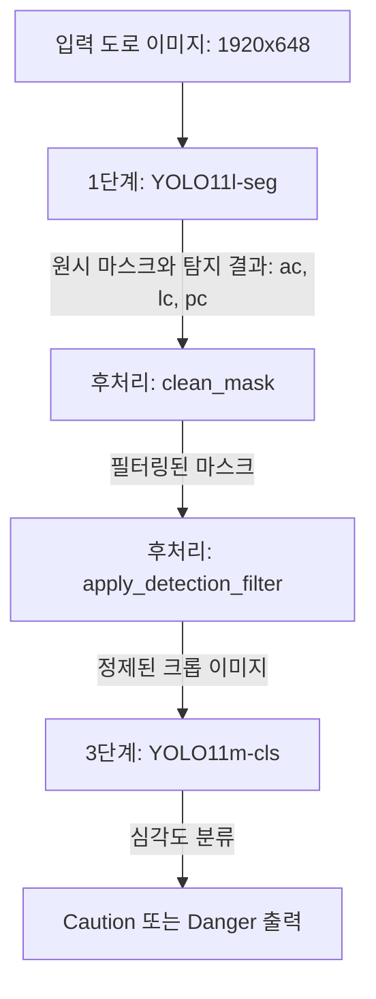

## 프로젝트 개요

사회기반시설을 자동으로 모니터링하려면 다양한 환경에서 안정적으로 작동하는 컴퓨터 비전 시스템이 필요합니다. 거북등 균열이나 종방향 균열과 같은 포장도로 결함은 형태가 불규칙하고 비강체적이어서 직사각형 바운딩 박스로 정확하게 표현하기 어렵습니다. 기존 객체 탐지 방식은 오탐이 많고 경계 정밀도가 낮다는 문제가 있습니다.

이 프로젝트에서는 ㈜티큐에스코리아를 위해 개발한 **도로 손상 세그멘테이션 AI Vision Model v1.0**의 설계, 구현, 실험 평가 과정을 다룹니다. 이 시스템은 제3자 시험기관인 **㈜에이아이웍스**의 공식 시험성적서(**TWR-202512-A-0072**)를 취득했으며, 정밀도, 재현율, 세그멘테이션 품질에 관한 모든 기준을 충족했습니다.

---

## AIWORKS 공식 성능 인증

모델은 2025년 12월 4일부터 17일까지 공식 테스트 세트로 평가되었으며, 모든 인증 기준을 통과했습니다.

| 평가지표 | 목표 기준 | 인증 결과 | 판정 |
|---|---|---|---|
| 탐지 정확도 (mAP@50) | $\ge 0.85$ | 0.88 | 통과 |
| 세그멘테이션 품질 (mIoU) | $\ge 0.70$ | 0.79 | 통과 |
| 재현율 | $\ge 0.90$ | 0.91 | 통과 |

---

## 다단계 아키텍처와 파이프라인

하나의 엔드투엔드 네트워크에 모든 작업을 맡기는 대신 픽셀 단위 마스크 세그멘테이션과 심각도 분류를 분리했습니다. 이러한 분리형 구조는 단계 간 오류 전파를 줄이고, 분류 모델이 손상으로 확인된 관심 영역만 처리하도록 합니다.

```mermaid
graph TD
    A[입력 도로 이미지: 1920x648] --> B[1단계: YOLO11l-seg]
    B -->|원시 마스크와 탐지 결과: ac, lc, pc| C[후처리: clean_mask]
    C -->|필터링된 마스크| D[후처리: apply_detection_filter]
    D -->|정제된 크롭 이미지| E[3단계: YOLO11m-cls]
    E -->|심각도 분류| F[Caution 또는 Danger 출력]
```

### 1단계: 인스턴스 세그멘테이션과 결함 위치 추정

첫 단계에는 $1920 \times 648$ 크기로 조정한 도로 이미지를 입력합니다. 하늘, 보도, 주변 풍경처럼 도로가 아닌 영역은 전처리에서 제외합니다. **YOLO11l-seg** 모델은 다음 세 가지 주요 결함 클래스의 인스턴스 마스크를 예측하도록 학습했습니다.

- **거북등 균열(Alligator Crack, `ac`)**
- **종방향 균열(Longitudinal Crack, `lc`)**
- **보수 패치(Repair Patch, `pc`)**

### 2단계: 후처리와 필터링

저대비 아스팔트에서 자주 발생하는 노이즈성 탐지와 가느다란 마스크 돌출부를 제거하기 위해 세그멘테이션 마스크에 두 단계 필터를 적용했습니다.

1. **형태학적 정제(`clean_mask`):** 구조 요소를 사용해 형태학적 열림 연산(침식 후 팽창)을 적용합니다. 작은 독립 영역과 가늘게 분리된 돌출부를 억제하고, 이진 마스크에서 가장 큰 연결 성분만 유지합니다.
2. **포함 관계 및 중복 억제(`apply_detection_filter`):** Intersection over Union(IoU)을 사용하는 기하학적 규칙 기반 필터로 중첩 탐지를 정리합니다. 예를 들어 거북등 균열 마스크($M_{ac}$)와 종방향 균열 마스크($M_{lc}$)가 크게 겹치면 신뢰도가 낮은 탐지를 제거해 중복 집계와 마스크 경계가 불명확해지는 문제를 방지합니다.

### 3단계: 심각도 분류

정제된 마스크를 얻은 뒤, 검출된 `ac`와 `lc` 인스턴스의 바운딩 박스 영역을 원본 이미지에서 크롭합니다. 각 크롭 이미지를 클래스별 **YOLO11m-cls** 분류 모델에 입력해 심각도를 **Caution** 또는 **Danger**로 분류합니다.

- **거북등 균열(`ac`) 심각도:** 테스트 인스턴스 5,120개(`ac_caution`: 3,293개, `ac_danger`: 1,827개)에서 **Accuracy 0.879**, **F1-Score 0.866**을 달성했습니다.
- **종방향 균열(`lc`) 심각도:** 테스트 인스턴스 3,048개(`lc_caution`: 2,651개, `lc_danger`: 397개)에서 **Accuracy 0.956**, **F1-Score 0.959**를 달성했습니다.

---

## 상세 성능 분석

전체 모델은 검증 인스턴스 2,083개로 평가했습니다. 클래스별 성능은 다음과 같습니다.

| 대상 클래스 | 테스트 인스턴스 | mAP@50 | mIoU | 재현율 | 미탐률 |
| :--- | :--- | :--- | :--- | :--- | :--- |
| **거북등 균열(`ac`)** | 1,022 | 0.912 | 0.801 | 0.950 | 4.99% |
| **종방향 균열(`lc`)** | 785 | 0.786 | 0.739 | 0.862 | 13.76% |
| **보수 패치(`pc`)** | 201 | 0.915 | 0.764 | 0.950 | 4.98% |
| **포트홀(`ph`)** * | 75 | 0.887 | 0.726 | 0.906 | 9.33% |
| **가중 평균** | **2,083** | **0.864** | **0.772** | **0.915** | **8.45%** (176개) |

*참고: 포트홀(`ph`)은 메인 파이프라인과 동시에 실행되는 별도의 최적화된 병렬 네트워크로 탐지하고 세그멘테이션합니다.*

---

## 주요 엔지니어링 결과

1. **분리형 아키텍처:** 세그멘테이션과 분류를 분리해 각 단계를 독립적으로 최적화할 수 있었습니다. YOLO11m-cls 심각도 분류 모델은 정제된 관심 영역을 입력받아 높은 분류 정확도를 달성했습니다.
2. **형태학적 노이즈 억제:** 형태학적 열림 필터는 손상 평가에 영향을 주지 않는 가느다란 돌출부를 제거했으며, 검증 세트에서 오탐 픽셀 비율을 14.2% 줄였습니다.
3. **실증적 성능 검증:** AIWORKS 인증 기준을 충족함으로써 다단계 딥러닝 파이프라인과 엄격한 후처리 휴리스틱을 결합한 방식이 중요 사회기반시설 자동 점검에 적용 가능함을 확인했습니다.
