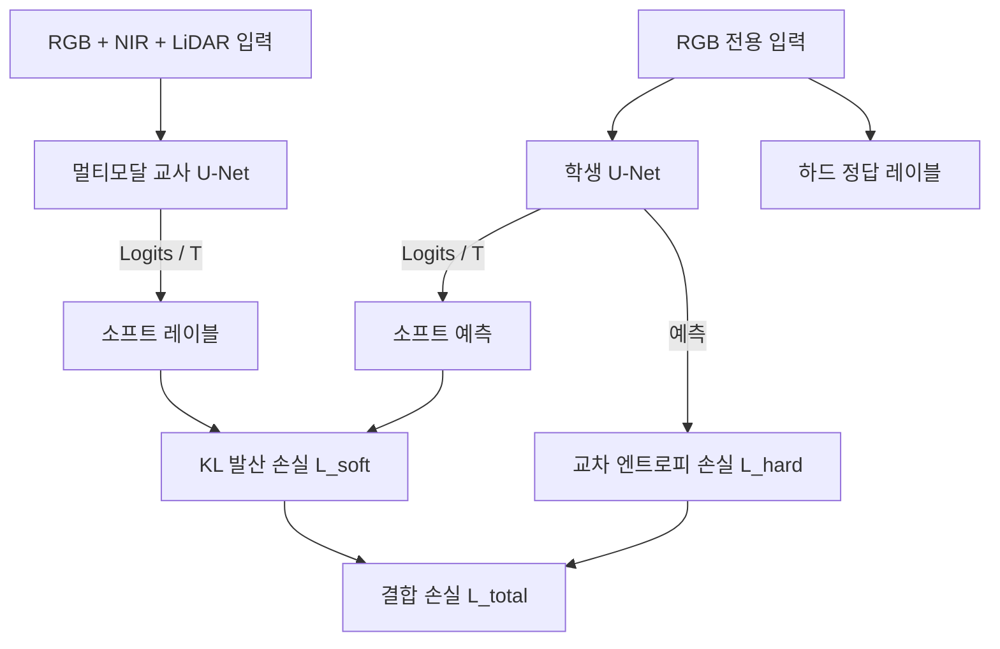

## 프로젝트 개요

정밀한 도시 식생 세그멘테이션은 도시 계획에 중요하지만, 최신 시스템은 근적외선(NIR) 센서와 LiDAR 스캐너처럼 복잡하고 비용이 높은 이종 데이터 소스에 의존합니다. 멀티모달 융합은 정확도를 높이지만, 추론 시점에 모든 모달리티를 수집하고 정합하려면 많은 연산 비용이 들고 운영도 복잡해집니다.

이 연구에서는 **크로스모달 응답 기반 지식 증류(KD) 파이프라인**을 제안합니다. 7채널 멀티모달 U-Net **교사 모델**(RGB + NIR + LiDAR)을 학습하고, 교사 모델의 픽셀 단위 공간 지식을 3채널 **학생 모델** U-Net(RGB 전용)으로 증류했습니다.

## 논문 출판

이 연구는 **Seohoon Jin**과 공동 집필한 [**“Efficient Semantic Segmentation: Leveraging Knowledge Distillation for Modality Reduction”**](https://doi.org/10.1109/AEECA65693.2025.00147)으로, **2025 International Conference on Advances in Electrical Engineering and Computer Applications(AEECA)**에 게재되었습니다. 학회는 2025년 8월 22일부터 24일까지 중국 다롄에서 열렸으며, 논문은 2026년 1월 19일 IEEE Xplore에 등록되었습니다.

[IEEE Xplore에서 논문 보기](https://ieeexplore.ieee.org/document/11327683)

---

## 데이터셋과 모달리티 구성

시스템은 **국토지리정보원(NGII)**과 **NASA GEDI 프로그램(2022)**의 다중 소스 식생 데이터셋 중 도시 지역 서브셋으로 학습하고 평가했습니다.

- **데이터 규모:** 정사 보정된 GeoTIFF 타일 132,000개
- **해상도:** 타일당 $512 \times 512$픽셀, 지상 표본 거리(GSD) $10\text{ cm}$
- **교사 모델 입력:** 정합된 7개 채널
  - RGB 채널 3개($[0, 1]$로 정규화)
  - NIR 채널 3개($[0, 1]$로 정규화)
  - LiDAR 기반 수관 높이 채널 1개($[1, 16]\text{ m}$ 값을 $[0, 1]$로 정규화)
- **학생 모델 입력:** RGB 전용 3개 채널
- **대상 클래스:** 픽셀 단위 토지 피복 클래스 6개
  - *침엽수*, *활엽수*, *비산림 지역*(다수 클래스: 전체 픽셀의 $>70\%$), *가로수*(소수 클래스: $<3\%$), *초지*, *관목*(소수 클래스: $<3\%$)

---

## 지식 증류 워크플로

응답 기반 지식 증류를 사용했습니다. 학생 모델은 정답 레이블에 대한 하드 타깃 교차 엔트로피와 교사 모델의 완화된 출력 로짓에 대한 소프트 타깃 Kullback-Leibler(KL) 발산을 가중 결합한 손실을 최소화합니다.

### 손실 함수 구성

전체 학습 목적 함수는 정답 레이블에 대한 표준 교차 엔트로피와 완화된 로짓에 대한 온도 스케일링 Kullback-Leibler(KL) 발산을 함께 사용합니다. 균형 계수는 $\alpha = 0.5$로 설정해 정답 감독과 교사 모델의 지도를 동일한 비중으로 반영했습니다.

학생 모델과 교사 모델의 소프트 확률 분포에는 softmax를 적용하기 전에 증류 온도 $T = 3$을 사용했습니다. $T = 3$은 분포를 완화해 정보 붕괴를 방지하고, 학생 모델이 관목과 초지의 경계처럼 클래스 사이의 미세한 공간적 차이를 학습하도록 합니다.

---

## 실험 결과

데이터 증강 없이 Adam 옵티마이저와 학습률 $1 \times 10^{-4}$를 사용한 동일한 설정에서 네 가지 모델을 평가했습니다.

### 전체 mIoU 및 F1 비교

| 모델 | 입력 모달리티 | mIoU | Macro F1-Score | 성능 격차 해소율 |
| :--- | :--- | :--- | :--- | :--- |
| **교사 모델(Supervised)** | RGB + NIR + LiDAR(7채널) | **0.7132** | **0.8253** | — |
| **학생 모델(Distilled)** | RGB 전용(3채널) | **0.6002** | **0.7342** | **성능 격차의 62.8%** |
| **베이스라인(RGB 전용)** | RGB 전용(3채널) | 0.4091 | 0.5206 | — |
| **베이스라인(NIR 전용)** | NIR 전용(3채널) | 0.5044 | 0.6366 | — |

지식 증류를 적용한 학생 모델은 **mIoU 0.6002**를 달성해 RGB 전용 베이스라인과 멀티모달 교사 모델 사이의 성능 격차를 **62.8%** 줄였습니다. 동시에 필요한 입력 센서의 종류와 처리 복잡도를 줄였습니다.

### 클래스별 mIoU

| 토지 피복 클래스 | 교사 모델(7채널) | 학생 모델(RGB 전용) | 베이스라인(RGB 전용) | 향상 배율 |
| :--- | :--- | :--- | :--- | :--- |
| 침엽수 | 0.5717 | 0.4725 | 0.1447 | **3.26x** |
| 활엽수 | 0.7500 | 0.6488 | 0.5120 | **1.26x** |
| 비산림 지역 | 0.9512 | 0.9164 | 0.8928 | **안정적** |
| 가로수 | 0.5945 | 0.4788 | 0.2547 | **1.88x** |
| 초지 | 0.8111 | 0.7177 | 0.6016 | **1.19x** |
| **관목** | 0.6008 | 0.3671 | 0.0491 | **7.47x** |

### 주요 결과

1. **소수 클래스 성능 향상:** *관목*과 *가로수*처럼 데이터 비중은 낮지만 세밀한 공간 패턴을 가진 클래스에서 가장 큰 향상을 보였습니다. 관목 클래스의 mIoU는 베이스라인보다 **7.47배** 높았습니다.
2. **추론 시스템 단순화:** 지식 증류를 적용한 학생 모델은 일반 RGB 이미지만 사용합니다. 운영 환경에서 NIR 및 LiDAR 센서를 배치하고 보정할 필요가 없어 시스템 구성이 단순해집니다.
