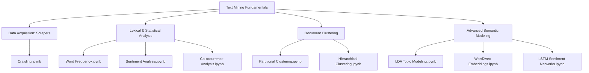

## Overview

Text mining represents a cornerstone of modern data science, bridging raw unstructured text and structured predictive modeling. However, students frequently struggle with the setup overhead and the mathematical transitions from traditional tf-idf matrices to sequential deep learning embeddings.

To resolve this, I developed **Text Mining Fundamentals with Python**, a comprehensive curriculum designed for my Teaching Assistant (TA) responsibilities in the Department of Big Data Science at **Korea University**. The curriculum centers around 11 specialized, task-oriented Jupyter Notebooks mapping the entire text mining lifecycle, supported by the Korean textbook *"잡아라! 텍스트마이닝 with 파이썬"*.

---

## Curriculum Structure & Modules

The course syllabus is mapped into separate, self-contained notebook templates located in the project repository:



### Syllabus Breakdown
1.  **Automated Data Scraping (`Crawling.ipynb`)**: Scrapes web data, processes HTTP requests, and parses HTML DOM structures using BeautifulSoup and requests.
2.  **Basic Lexical Statistics (`Word Frequency Analysis.ipynb`)**: Performs tokenization, filters stop words, and visualizes word frequencies using NLTK and Matplotlib.
3.  **Lexicon-based Sentiment (`Simple sentiment analysis.ipynb` & `Sentiment Analysis.ipynb`)**: Analyzes sentiments using AFINN and custom dictionary-based lookups.
4.  **Co-occurrence Frequency (`Co-occurrence Frequency Analysis.ipynb`)**: Computes word-word co-occurrence matrices and constructs semantic networks using NetworkX.
5.  **Vector-based Text Similarity (`Association Analysis with TF-IDF & Cosine Similarity.ipynb`)**: Computes Term Frequency-Inverse Document Frequency (TF-IDF) weights and calculates cosine similarity matrices.
6.  **Document Clustering (`Partitional Clustering.ipynb` & `Hierarchical Clustering.ipynb`)**: Implements K-Means (non-hierarchical) and agglomerative nesting algorithms using Scikit-Learn and Scipy.
7.  **Semantic Associations (`Association Analysis with Word2Vec.ipynb`)**: Trains shallow continuous bag-of-words (CBOW) and skip-gram models to learn continuous vector representations of words using Gensim.
8.  **Generative Topic Modeling (`LDA Topic Modeling.ipynb`)**: Details Latent Dirichlet Allocation (LDA) to extract hidden thematic mixtures from document collections.
9.  **Sequential Deep Learning (`LSTM-based Sentiment Analysis.ipynb`)**: Builds Recurrent Neural Networks (RNN) with Long Short-Term Memory (LSTM) cells in TensorFlow/Keras to perform sentiment classification over padded token sequences.

---

## Disciplined Environment Management

To guarantee reproducible executions across student machines, the curriculum defines a strict environment setup protocol:

### Conda Environment Configuration
Students initialize a dedicated virtual environment with specific Python and package builds:

```bash
# 1. Initialize a clean virtual environment
conda create -n textmining python=3.9 -y

# 2. Activate the environment
conda activate textmining

# 3. Install Jupyter kernel configurations
pip install ipykernel notebook

# 4. Register the custom kernel to Jupyter notebook
python -m ipykernel install --user --name textmining --display-name "Python (textmining)"
```

### Required Dependencies
The `requirements.txt` locks the core scientific, NLP, and deep learning libraries:
- **Core Processing**: `numpy`, `pandas`, `scipy`
- **Visualization**: `matplotlib`, `seaborn`, `wordcloud`
- **Machine Learning**: `scikit-learn`, `pyclustering`, `networkx`
- **NLP & Semantics**: `nltk`, `gensim`, `afinn`
- **Deep Learning**: `tensorflow`
- **Data Scraping**: `beautifulsoup4`, `requests`
- **Korean NLP**: `kiwipiepy` (Kiwi morph analyzer)
