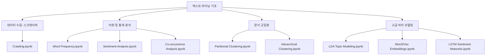

## 프로젝트 개요

텍스트 마이닝은 비정형 텍스트를 구조화된 예측 모델로 연결하는 현대 데이터 사이언스의 핵심 분야입니다. 그러나 학생들은 개발 환경을 설정하는 데 많은 시간을 쓰고, TF-IDF 행렬 같은 전통적인 표현에서 시퀀스 기반 딥러닝 모델로 넘어갈 때 필요한 수학적 개념을 이해하는 데 어려움을 겪습니다.

이를 해결하기 위해 고려대학교 **빅데이터사이언스 학부** 조교 업무의 일환으로 **Python으로 배우는 텍스트 마이닝 기초** 교육 과정을 개발했습니다. 교재 *『잡아라! 텍스트마이닝 with 파이썬』*을 바탕으로 텍스트 마이닝 전 과정을 다루는 과제 중심의 Jupyter Notebook 11개를 구성했습니다.

---

## 교육 과정과 모듈

프로젝트 저장소에는 각각 독립적으로 실행할 수 있는 Notebook 템플릿이 주제별로 구성되어 있습니다.


```mermaid
graph TD
    A[텍스트 마이닝 기초] --> B[데이터 수집: 스크레이퍼]
    A --> C[어휘 및 통계 분석]
    A --> D[문서 군집화]
    A --> E[고급 의미 모델링]

    B --> B1[Crawling.ipynb]
    C --> C1[Word Frequency.ipynb]
    C --> C2[Sentiment Analysis.ipynb]
    C --> C3[Co-occurrence Analysis.ipynb]
    D --> D1[Partitional Clustering.ipynb]
    D --> D2[Hierarchical Clustering.ipynb]
    E --> E1[LDA Topic Modeling.ipynb]
    E --> E2[Word2Vec Embeddings.ipynb]
    E --> E3[LSTM Sentiment Networks.ipynb]
```

### 세부 교육 내용

1. **자동 데이터 수집(`Crawling.ipynb`):** BeautifulSoup과 requests를 사용해 웹 데이터를 수집하고 HTTP 요청과 HTML DOM 구조를 처리합니다.
2. **기초 어휘 통계(`Word Frequency Analysis.ipynb`):** NLTK와 Matplotlib를 사용해 토큰화, 불용어 제거, 단어 빈도 시각화를 수행합니다.
3. **감성 사전 기반 분석(`Simple sentiment analysis.ipynb`, `Sentiment Analysis.ipynb`):** AFINN과 사용자 정의 감성 사전을 조회해 텍스트의 감성을 분석합니다.
4. **동시출현 빈도 분석(`Co-occurrence Frequency Analysis.ipynb`):** 단어 간 동시출현 행렬을 계산하고 NetworkX로 의미 네트워크를 구성합니다.
5. **벡터 기반 텍스트 유사도(`Association Analysis with TF-IDF & Cosine Similarity.ipynb`):** Term Frequency-Inverse Document Frequency(TF-IDF) 가중치와 코사인 유사도 행렬을 계산합니다.
6. **문서 군집화(`Partitional Clustering.ipynb`, `Hierarchical Clustering.ipynb`):** scikit-learn과 SciPy를 사용해 K-Means 분할 군집화와 응집형 계층 군집화를 구현합니다.
7. **단어 의미 관계(`Association Analysis with Word2Vec.ipynb`):** Gensim을 사용해 얕은 Continuous Bag-of-Words(CBOW)와 Skip-gram 모델을 학습하고 단어의 연속 벡터 표현을 만듭니다.
8. **LDA 토픽 모델링(`LDA Topic Modeling.ipynb`):** Latent Dirichlet Allocation(LDA)을 사용해 문서 집합에 숨어 있는 주제 분포를 추출합니다.
9. **시퀀스 딥러닝(`LSTM-based Sentiment Analysis.ipynb`):** TensorFlow/Keras로 Long Short-Term Memory(LSTM) 셀을 사용하는 Recurrent Neural Network(RNN)를 구성하고, 패딩된 토큰 시퀀스의 감성을 분류합니다.

---

## 재현 가능한 실행 환경 관리

학생마다 다른 컴퓨터에서도 같은 결과를 재현할 수 있도록 명확한 환경 설정 절차를 정의했습니다.

### Conda 환경 설정

학생들은 지정된 Python 및 패키지 버전으로 별도의 가상 환경을 만듭니다.

```bash
# 1. Initialize a clean virtual environment
conda create -n textmining python=3.9 -y

# 2. Activate the environment
conda activate textmining

# 3. Install Jupyter kernel configurations
pip install ipykernel notebook

# 4. Register the custom kernel to Jupyter notebook
python -m ipykernel install --user --name textmining --display-name "Python (textmining)"
```

### 필수 의존성

`requirements.txt`에는 과학 계산, NLP, 딥러닝에 필요한 핵심 라이브러리 버전을 고정했습니다.

- **기본 처리:** `numpy`, `pandas`, `scipy`
- **시각화:** `matplotlib`, `seaborn`, `wordcloud`
- **머신러닝:** `scikit-learn`, `pyclustering`, `networkx`
- **NLP 및 의미 분석:** `nltk`, `gensim`, `afinn`
- **딥러닝:** `tensorflow`
- **웹 데이터 수집:** `beautifulsoup4`, `requests`
- **한국어 NLP:** `kiwipiepy`(Kiwi 형태소 분석기)
