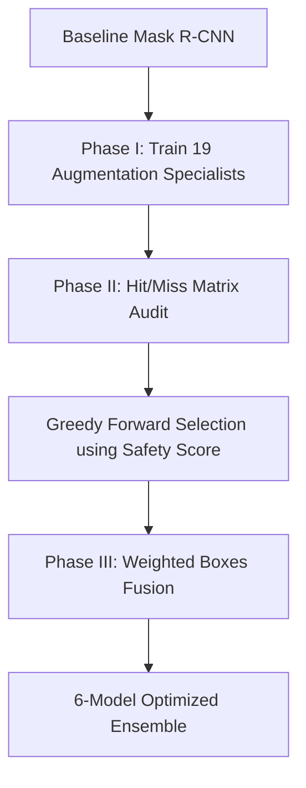

## Overview

Traditional object detection architectures are optimized for "Things" (rigid foreground objects with well-defined boundaries like vehicles or pedestrians). They fail catastrophically when applied to "Stuff" (low-contrast, texture-defined anomalies lacking geometric structure, such as pavement cracks or surface defects). We define this compound failure as the **Amorphous Bottleneck**.

This case study presents a data-centric, recall-optimized ensemble pipeline designed to resolve the Amorphous Bottleneck. Starting with a single Mask R-CNN baseline (ResNet-50-FPN), we train and audit **nineteen augmentation specialists**, fusing their outputs with **Weighted Boxes Fusion (WBF)** and selecting the optimal **6-model team** via a **Greedy Forward Selection (GFS)** algorithm.

---

## The Core Mathematical Framework

### 1. Weber Contrast Limitation
To quantify the visual difficulty of the dataset, we calculate the Weber contrast ($C_w$) of each target anomaly against its immediate background:

$$
C_w = \frac{|I_{\text{object}} - I_{\text{background}}|}{I_{\text{background}}}
$$

Across the 9,028 instance annotations, the mean Weber contrast is **0.0824**, and **95.67% of labeled defects sit below the psychophysical detection threshold ($C_w = 0.2$)**. Under this low-contrast regime, human annotation boundaries are highly inconsistent, introducing significant label noise.

### 2. Custom Asymmetric Safety Score
To optimize for recall while keeping false positive accumulation bounded, the GFS algorithm evaluates models on the validation set using an asymmetric Safety Score ($S$):

$$
S = T_{TP} - \alpha \cdot T_{FP}
$$

where:
- $T_{TP}$ is the net true positive count after fusion.
- $T_{FP}$ is the count of unverified (false positive) predictions.
- $\alpha = 0.1$ is a scale factor reflecting the operational reality that a missed defect is ten times more expensive than a false alarm.

---

## Pipeline and Architecture

### Hit/Miss Matrix Audit
Rather than evaluating models using average precision (AP) which averages out localization details, we execute an instance-level **Hit/Miss audit**. For every validation image and every ground truth bounding box (at $IoU \ge 0.5$), we track:
- **Retained True Positives**: Cases where both baseline and specialist hit the target.
- **Algorithmic Rescues**: Targets missed by the baseline but successfully detected by the specialist.
- **Algorithmic Regressions**: Targets hit by the baseline but missed by the specialist.

---

## Experimental Results

On the held-out test split (591 images, 1,812 ground truth boxes), the final frozen 6-model ensemble (fused at $IoU = 0.55$, confidence threshold $= 0.90$) achieved:

| Metric | Baseline | 6-Model Ensemble | $\Delta$ |
| :--- | :--- | :--- | :--- |
| **mAP@50:95** | 0.5420 | 0.5598 | **+0.0178** |
| **AP@50** | 0.7958 | 0.8033 | **+0.0075** |
| **Operational Recall** (conf > 0.50) | 0.8317 | 0.9089 | **+0.0772** |
| **Optimal F1 Threshold** | 0.75 | 0.90 | **Decisive shift** |

### The 27:1 Rescue-to-Regression Ratio
The instance audit on the test set revealed:
- **135 Algorithmic Rescues** (previously missed defects recovered by the ensemble).
- **5 Algorithmic Regressions** (previously detected defects missed by the ensemble).

This yields a **27:1 rescue-to-regression ratio**, showing that the ensembled augmentations act as highly complementary feature priors.

---

## The Precision Paradox & Ghost Detections

The operational precision of the ensemble drops from 0.7125 to 0.5457 at a threshold of 0.50. To understand this drop, we audited the **168 "Ghost Detections"** (high-confidence ensemble predictions with $IoU < 0.05$ against any ground truth annotation).

A rigorous manual audit of these 168 ghosts across 114 images proved the **Precision Paradox**:
- **95.2% (160/168)** of the "false alarms" were actually valid physical defects that had been missed by human annotators during ground-truth labeling.
- Only **8/168** cases were borderline (dirt, debris, or cement patch textures), and zero cases were actual model hallucinations.

This demonstrates that standard precision metrics penalize AI models when they outperform the noisy human supervision they were trained on, proving that a recall-first, data-centric approach is the only path forward for amorphous defect detection.
