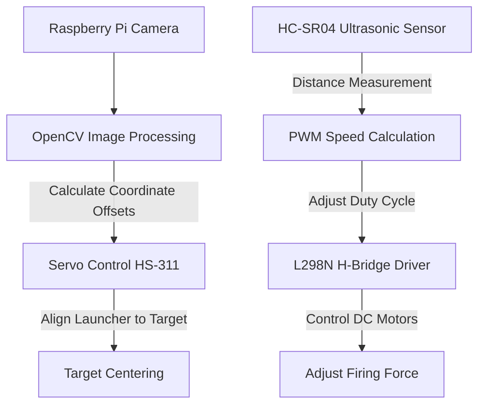

## Overview

Traditional ball launchers operate on manual alignment and fixed firing speeds, making them ineffective at adapting to moving targets. To solve this, we designed **Dodgeball**—an autonomous target-tracking and ball launching machine. Developed as a major core engineering project, the system combines real-time computer vision tracking, closed-loop servo control, and distance-adaptive motor speed regulation.

---

## System Architecture

The system is constructed with a dual-loop control pipeline:
1. **Target Tracking Loop**: The Raspberry Pi Camera tracks the coordinates of a red spherical target. The coordinate offset from the frame center controls a high-torque standard servo motor to rotate the launcher platform horizontally.
2. **Firing Force Control Loop**: An ultrasonic sensor measures the physical distance to the target. A custom mapping function converts this distance into a specific pulse-width modulation (PWM) duty cycle, controlling the dual DC motor launcher wheels via an L298N H-bridge.

### Circuit Schematic
Below is the circuit schematic detailing the connections between the Raspberry Pi, standard servo motor, L298N motor driver, and sensors:

---

## Key Implementation Details

### 1. Robust OpenCV Target Isolation
Early testing using RGB thresholding failed under varying room lighting, as reflections and shadow tones interfered with color classification. 
To resolve this, we migrated the image processing pipeline to the **HSV (Hue, Saturation, Value) color space**. By isolating the Hue channel (representing pure color) and applying strict bounding ranges, the system dynamically filters background noise and extracts the precise centroid of the red target:
- **Centroid Calculation**: Computes the contour moments to determine the $(x, y)$ coordinate of the target's center.
- **Error Tuning**: Compares the target center against the camera frame center. If the offset exceeds a dead band of $\pm 30$ pixels, the system sends an incremental PWM command to the servo to rotate the platform and re-center the target.

### 2. Segmented Linear Firing Interpolation
DC motor startup thresholds and mechanical resistance cause non-linear relationships between voltage and firing range.
To achieve reliable hits across the active launch range (50 cm to 210 cm), we designed a segmented linear mapping function. The Raspberry Pi reads the distance from the HC-SR04 sensor and interpolates the appropriate PWM duty cycle:
- For distances under 50 cm: The DC motor remains at a low baseline duty cycle.
- For distances between 50 cm and 210 cm: The system dynamically scales the duty cycle using the formula: $\text{Duty} = 10\% + (\text{Distance} - 50) \times 0.05\%$.
- For distances exceeding 210 cm: The motors default to maximum output capacity.

---

## Technical Challenges & Solutions

1. **Power Supply Instability**: Simultaneously driving the Raspberry Pi, dual launching DC motors, and standard positioning servos from a common battery pack caused voltage sags, resetting the microcontrollers. 
   - *Solution*: Designed a decoupled power rail system utilizing a dedicated high-current 12V DC power adapter, with separate voltage regulators for the control logic and high-draw motors.
2. **Platform Balancing**: Heavy camera mounts and motors placed off-center caused tracking platform tilt and servo stalling.
   - *Solution*: Re-machined the structural components out of lightweight acrylic sheets and systematically arranged the weight distribution around the servo's primary rotational axis to minimize torque loads.
3. **Servo Motor Delay Tuning**: Rapid, unbuffered adjustments to the servo position caused oscillation and blurred camera inputs.
   - *Solution*: Introduced a brief temporal delay (smoothing window) in the control loop, allowing the servo motor to settle before capturing the next camera frame.

---

## Demonstration Video

Below is the hardware test demonstration of the Dodgeball launcher tracking and firing at the target in real time:

  <iframe 
    src="https://www.youtube.com/embed/RzG0mym6OIU" 
    title="Dodgeball Autonomous Ball Launcher Test Video" 
    frameborder="0" 
    allow="accelerometer; autoplay; clipboard-write; encrypted-media; gyroscope; picture-in-picture; web-share" 
    allowfullscreen 
    style="position: absolute; top: 0; left: 0; width: 100%; height: 100%;"
  ></iframe>

