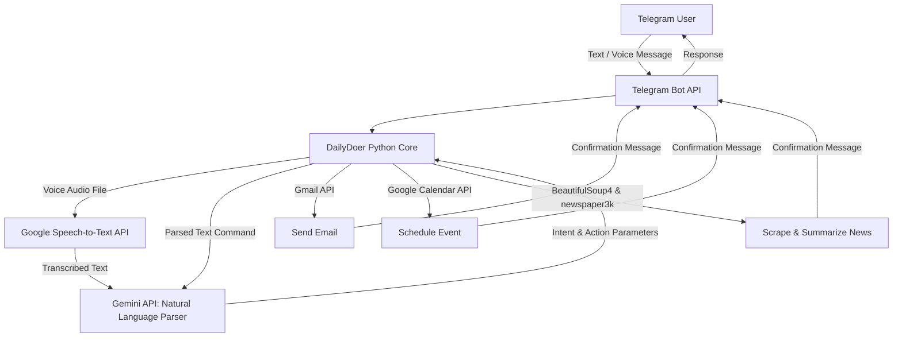

## Overview

Managing calendars, drafting emails, and keeping up with daily news feeds across separate tabs can be time-consuming. **DailyDoer Agent** is a conversational Telegram assistant designed to unify these tasks into a single chat window. 

By leveraging the Google Gemini API, the bot processes natural language (both text and voice messages) to execute actions such as scheduling events, sending emails, transcribing audio, and summarizing web articles.

---

## System Architecture

---

## Core Features & Integrations

### 1. Natural Language Intent Parsing
- Powered by **Google Gemini (`gemini-1.5-flash-latest`)**, the bot functions as a zero-shot intent classifier. It translates casual natural language (e.g., *"Schedule a sync meeting with the team tomorrow at 2 PM"*) into structured API calls containing target email addresses, dates, and event descriptions.

### 2. Voice Command Transcription
- Integrates the **Google Cloud Speech-to-Text API** via `google-cloud-speech` to transcribe voice notes in real time. The transcribed commands are routed directly into the NLU engine, enabling hands-free system interaction.

### 3. Google Workspace Automation
- **Calendar Management**: Interacts with the **Google Calendar API** to list events, identify schedule conflicts, and write new events with specific start and end times.
- **Email Integration**: Utilizes the **Gmail API** to draft and dispatch emails through authenticated Gmail accounts using secure OAuth2 authorization flows (`credentials.json`, `token.json`).

### 4. News Scraper & Summarizer
- Pulls and digests text from user-provided URLs using **`newspaper3k`** and **`httpx`**.
- Features an automated homepage scraper powered by **BeautifulSoup4** that extracts articles from pre-configured news homepages, summarizes the content using Gemini, and delivers a concise daily digest to the user.

---

## Technical Challenges & Solutions

1. **Fragile Web Scraping**: Static HTML structures on news sites change frequently, causing BeautifulSoup4 CSS selector failures.
   - *Solution*: Leveraged the robust heuristics of `newspaper3k` for main text extraction, leaving BeautifulSoup4 solely responsible for lightweight link gathering from homepage structures.
2. **Secure Token Lifecycle**: Managing Gmail and Google Calendar access tokens without constant manual re-authentication.
   - *Solution*: Implemented a local file token repository (`token.json`) that manages automated token refresh loops, requesting user re-authentication only when tokens expire or are revoked.

---

## GitHub Repository
Check out the complete installation instructions, credential setup guides, and Python source code on GitHub:
👉 [AlexL71/Daily-Doer---Agent](https://github.com/AlexL71/Daily-Doer---Agent)
