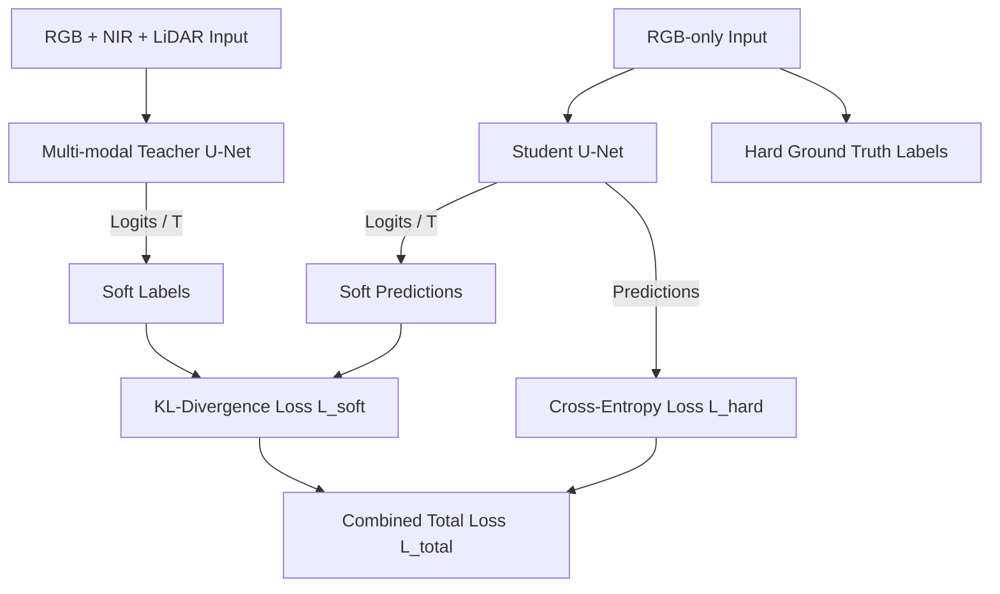

## Overview

High-fidelity urban vegetation segmentation is critical for urban planning, but state-of-the-art systems rely on complex, expensive, and heterogeneous data sources like Near-Infrared (NIR) sensors and LiDAR scanners. While this multi-modal fusion boosts accuracy, collecting and co-registering all modalities at inference is computationally expensive and logistically difficult.

This case study presents a **cross-modal response-based knowledge distillation (KD) pipeline**. We train a 7-channel multi-modal U-Net **Teacher** (RGB + NIR + LiDAR) and distill its dense spatial insights into a lightweight 3-channel **Student** U-Net (RGB-only). 

---

## Dataset & Modality Specifications

The system is trained and evaluated on an urban subset of the multi-source vegetation dataset compiled by the **Korea National Geographic Information Institute (NGII)** and **NASA’s GEDI program (2022)**:

- **Volume**: 132,000 ortho-rectified GeoTIFF tiles.
- **Resolution**: $512 \times 512$ pixels per tile at a $10\text{ cm}$ ground-sampling distance (GSD).
- **Teacher Inputs**: 7 co-registered channels:
  - 3 RGB channels (normalized to $[0, 1]$).
  - 3 NIR channels (normalized to $[0, 1]$).
  - 1 LiDAR-derived canopy-height channel (values in $[1, 16]\text{ m}$ normalized to $[0, 1]$).
- **Student Inputs**: 3 channels (RGB-only).
- **Target Classes**: 6 pixel-level land-cover categories:
  - *Coniferous Trees*, *Broadleaf Trees*, *Non-Forest Area* (dominant: $>70\%$ of pixels), *Street Trees* (minority: $<3\%$), *Grassland*, and *Shrubs* (minority: $<3\%$).

---

## Knowledge Distillation Workflow

We use response-based knowledge distillation, where the student model minimizes a weighted combination of hard target cross-entropy and soft target Kullback-Leibler (KL) divergence over the teacher's softened output logits:

### Loss Function Formulations

The total training objective $L_{\text{total}}$ is defined as:

$$
L_{\text{total}} = \alpha L_{\text{hard}} + (1 - \alpha) L_{\text{soft}}
$$

where:
- $\alpha = 0.5$ balances ground-truth supervision and teacher guidance.
- $L_{\text{hard}}$ is the standard categorical cross-entropy loss against the one-hot ground truth labels.
- $L_{\text{soft}}$ is the temperature-scaled KL-divergence:

$$
L_{\text{soft}} = T^2 \cdot \text{KL}(p_s^T \parallel p_t^T)
$$

The softened probability distributions for student ($p_s^T$) and teacher ($p_t^T$) are scaled by the distillation temperature $T = 3$ before applying the softmax operator:

$$
p_i^T = \frac{\exp(z_i / T)}{\sum_j \exp(z_j / T)}
$$

Setting $T = 3$ softens the probability distributions, preventing information collapse and allowing the student to learn subtle, inter-class spatial boundaries (e.g., the transition between shrubs and grassland).

---

## Experimental Results

We evaluated four variants under identical settings (no data augmentation, Adam optimizer, learning rate $1 \times 10^{-4}$):

### Overall mIoU & F1 Comparison
| Model | Input Modalities | mIoU | Macro F1-Score | Gap Closed |
| :--- | :--- | :--- | :--- | :--- |
| **Teacher (Supervised)** | RGB + NIR + LiDAR (7 Ch) | **0.7132** | **0.8253** | — |
| **Student (Distilled)** | RGB-only (3 Ch) | **0.6002** | **0.7342** | **62.8% of the gap** |
| **Baseline (RGB-only)** | RGB-only (3 Ch) | 0.4091 | 0.5206 | — |
| **Baseline (NIR-only)** | NIR-only (3 Ch) | 0.5044 | 0.6366 | — |

The distilled student model achieves **0.6002 mIoU**, closing **62.8%** of the performance gap between the RGB-only baseline and the multi-modal teacher, while reducing sensor cost and input processing complexity by half.

### Class-Wise mIoU Breakdowns
| Land-Cover Class | Teacher (7 Ch) | Student (RGB-only) | Baseline (RGB-only) | Improvement factor |
| :--- | :--- | :--- | :--- | :--- |
| Coniferous Trees | 0.5717 | 0.4725 | 0.1447 | **3.26x** |
| Broadleaf Trees | 0.7500 | 0.6488 | 0.5120 | **1.26x** |
| Non-Forest Area | 0.9512 | 0.9164 | 0.8928 | **Stable** |
| Street Trees | 0.5945 | 0.4788 | 0.2547 | **1.88x** |
| Grassland | 0.8111 | 0.7177 | 0.6016 | **1.19x** |
| **Shrubs** | 0.6008 | 0.3671 | 0.0491 | **7.47x** |

### Key Takeaways
1. **Minority Class Boosting**: Underrepresented classes with high spatial frequency (like *Shrubs* and *Street Trees*) experienced the largest gains, with *Shrubs* mIoU increasing by **7.47x** over the baseline.
2. **Simplified Inference**: The distilled student operates on standard RGB images, eliminating the need to deploy and calibrate NIR and LiDAR sensors in production, simplifying system architecture.
