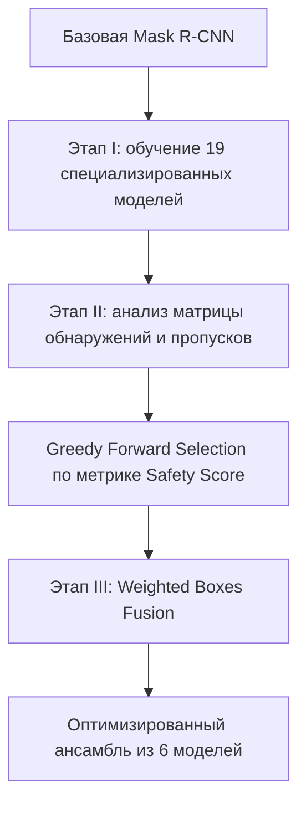

## Обзор

Обычные архитектуры обнаружения объектов хорошо работают с отдельными предметами, у которых есть чёткие границы, например с автомобилями или пешеходами. Но они значительно хуже распознают низкоконтрастные и неоднородные структуры без устойчивой геометрической формы, такие как трещины и дефекты дорожного покрытия. Это сочетание проблем я называю **The Amorphous Bottleneck** («аморфным узким местом»).

В этом исследовании представлен ориентированный на данные ансамбль с приоритетом полноты. В качестве основы используется Mask R-CNN с ResNet-50-FPN. Затем обучаются и проверяются **19 специализированных моделей с разными способами аугментации**. Их результаты объединяются методом **Weighted Boxes Fusion (WBF)**, а оптимальный ансамбль из **6 моделей** выбирается алгоритмом **Greedy Forward Selection (GFS)**.

## Презентация на конференции и статус публикации

Я представил работу **“The Amorphous Bottleneck: A Recall Optimized Ensemble for Anomaly Detection”** на конференции **CVGAI 2026**. В докладе я объяснил, почему стандартные детекторы плохо работают с низкоконтрастными дорожными дефектами неправильной формы, и представил систему из 19 специализированных моделей, Greedy Forward Selection и Weighted Boxes Fusion. Итоговый ансамбль увеличил полноту при рабочем пороге на **7,7 процентного пункта** и обнаружил реальные дефекты, пропущенные при исходной разметке.

Полная статья проходит процедуру публикации в **SPIE Conference Proceedings** (ISSN 0277-786X). Планируется индексация в EI Compendex и Scopus. [Посмотреть публикацию о выступлении в LinkedIn](https://www.linkedin.com/posts/abdurakhmon-dadaboev_computervision-anomalydetection-machinelearning-activity-7477337404710756353-5TZz).

  <figure class="project-figure project-figure-wide">
    
    <figcaption>The Amorphous Bottleneck объединяет ошибки распознавания, непоследовательность разметки и ограничения оценки.</figcaption>
  </figure>
  <figure class="project-figure">
    
    <figcaption>Презентация статьи на CVGAI 2026.</figcaption>
  </figure>
  <figure class="project-figure">
    
    <figcaption>Объяснение различия между отдельными объектами и аморфными структурами.</figcaption>
  </figure>

---

## Основная математическая модель

### 1. Ограничение контраста Вебера
Чтобы измерить визуальную сложность данных, для каждой аномалии вычисляется контраст Вебера $C_w = |I_{\text{object}} - I_{\text{background}}| / I_{\text{background}}$ относительно ближайшего фона. Для 9 028 размеченных объектов среднее значение составило **0,0824**, а **95,67% дефектов находятся ниже психофизического порога обнаружения ($C_w = 0,2$)**. При таком низком контрасте люди проводят границы непоследовательно, что создаёт заметный шум в разметке.

### 2. Асимметричная метрика Safety Score
Чтобы повысить полноту и при этом ограничить количество ложных срабатываний, GFS оценивает модели по формуле $S = T_{TP} - \alpha \cdot T_{FP}$. Здесь $T_{TP}$ обозначает число верных обнаружений, $T_{FP}$ — число ложных срабатываний, а $\alpha = 0,1$ отражает условие, что пропущенный дефект в десять раз важнее ложной тревоги.

---

## Процесс и архитектура

### Анализ обнаружений и пропусков
Вместо одной усреднённой метрики AP проводится проверка каждого объекта. Для каждого изображения и каждого объекта в эталонной разметке при $IoU \ge 0,5$ учитываются:

- **Сохранённые верные обнаружения:** объект найден и базовой, и специализированной моделью.
- **Исправленные пропуски:** базовая модель пропустила объект, но специализированная модель его нашла.
- **Регрессии:** базовая модель нашла объект, а специализированная пропустила.

---

## Результаты эксперимента

На отдельной тестовой выборке из 591 изображения и 1 812 эталонных рамок итоговый ансамбль из шести моделей при $IoU = 0,55$ и пороге уверенности $0,90$ показал следующие результаты:

| Метрика | Базовая модель | Ансамбль из 6 моделей | $\Delta$ |
| :--- | :--- | :--- | :--- |
| **mAP@50:95** | 0.5420 | 0.5598 | **+0.0178** |
| **AP@50** | 0.7958 | 0.8033 | **+0.0075** |
| **Полнота при рабочем пороге** (conf > 0.50) | 0.8317 | 0.9089 | **+0.0772** |
| **Оптимальный порог F1** | 0.75 | 0.90 | **Заметное изменение** |

### Соотношение исправлений и регрессий 27 к 1
Проверка отдельных объектов показала:

- **135 исправленных пропусков:** ансамбль нашёл дефекты, пропущенные базовой моделью.
- **5 регрессий:** ансамбль пропустил дефекты, найденные базовой моделью.

Соотношение **27 к 1** показывает, что модели с разными аугментациями действительно дополняют друг друга.

---

## Парадокс метрики precision и «призрачные» обнаружения

При пороге 0,50 значение precision ансамбля снижается с 0,7125 до 0,5457. Чтобы понять причину, я вручную проверил **168 «призрачных» обнаружений**: детекции с высокой уверенностью и $IoU < 0,05$ относительно любой эталонной разметки.

Проверка 168 случаев на 114 изображениях показала **парадокс метрики precision**:

- **95,2% (160 из 168)** предполагаемых ложных срабатываний оказались реальными физическими дефектами, пропущенными людьми при разметке.
- Только **8 из 168** случаев были спорными: грязь, мусор или текстура цементной заплатки. Ни один случай не оказался настоящей галлюцинацией модели.

Этот результат показывает, что стандартные метрики могут штрафовать модель за обнаружение реальных объектов, отсутствующих в шумной разметке. Для аморфных дефектов поэтому особенно важны приоритет полноты, качественные данные и ручная проверка.
