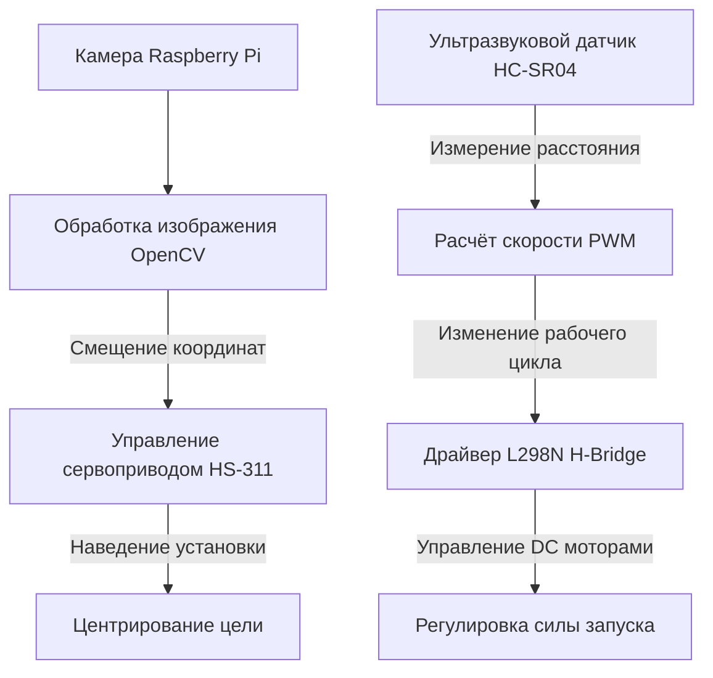

## Обзор

Обычные установки для запуска мяча требуют ручного наведения и работают с фиксированной скоростью, поэтому плохо адаптируются к движущейся цели. В проекте **Dodgeball** создана автономная система, которая сама отслеживает цель и запускает мяч. Она объединяет компьютерное зрение в реальном времени, сервопривод с обратной связью и регулировку скорости моторов по расстоянию.

---

## Архитектура системы

Система состоит из двух контуров управления:

1. **Отслеживание цели:** камера Raspberry Pi определяет координаты красного шара. Смещение относительно центра кадра управляет сервоприводом, который поворачивает платформу по горизонтали.
2. **Регулировка силы запуска:** ультразвуковой датчик измеряет расстояние. Специальная функция преобразует его в рабочий цикл широтно импульсной модуляции (PWM), управляющий двумя DC моторами через мост L298N.

### Электрическая схема

На схеме показаны соединения Raspberry Pi, сервопривода, драйвера L298N и датчиков:

---

## Ключевые детали реализации

### 1. Устойчивое выделение цели в OpenCV

Первые тесты с порогами RGB были нестабильны при изменении освещения: отражения и тени мешали классификации цвета. Поэтому обработка была переведена в цветовое пространство **HSV (тон, насыщенность, яркость)**. Канал тона помогает отделить чистый цвет от освещения, отфильтровать фон и найти центр красной цели.

- **Расчёт центра:** моменты контура определяют координаты $(x, y)$ центра цели.
- **Коррекция ошибки:** координаты сравниваются с центром кадра. Если смещение превышает мёртвую зону $\pm 30$ пикселей, сервопривод получает PWM команду и снова центрирует цель.

### 2. Сегментированная регулировка силы запуска

Порог запуска DC моторов и механическое сопротивление создают нелинейную связь между напряжением и дальностью. Для устойчивой работы на расстоянии от 50 до 210 см используется кусочно линейная функция. Raspberry Pi получает расстояние от HC-SR04 и рассчитывает рабочий цикл PWM:

- До 50 см моторы работают на низком базовом уровне.
- От 50 до 210 см применяется формула $\text{Duty} = 10\% + (\text{Distance} - 50) \times 0.05\%$.
- После 210 см моторы переходят на максимальную мощность.

---

## Технические проблемы и решения

1. **Нестабильное питание:** одновременная работа Raspberry Pi, двух DC моторов и сервопривода вызывала просадку напряжения и перезапуск контроллера.
   - *Решение:* отдельный мощный источник 12 В и независимые регуляторы для логики и моторов.
2. **Баланс платформы:** тяжёлая камера и смещённые моторы наклоняли платформу и перегружали сервопривод.
   - *Решение:* лёгкие акриловые детали и перераспределение массы вокруг оси вращения.
3. **Колебания сервопривода:** слишком быстрые команды вызывали вибрацию и смазывание изображения.
   - *Решение:* короткая задержка в контуре управления даёт приводу стабилизироваться перед следующим кадром.

---

## Демонстрационное видео

Видео показывает, как установка Dodgeball отслеживает цель и запускает мяч в реальном времени:

  <iframe
    src="https://www.youtube.com/embed/RzG0mym6OIU"
    title="Испытание автоматической пусковой установки Dodgeball"
    frameborder="0"
    allow="accelerometer; autoplay; clipboard-write; encrypted-media; gyroscope; picture-in-picture; web-share"
    allowfullscreen
    style="position: absolute; top: 0; left: 0; width: 100%; height: 100%;"
  ></iframe>

