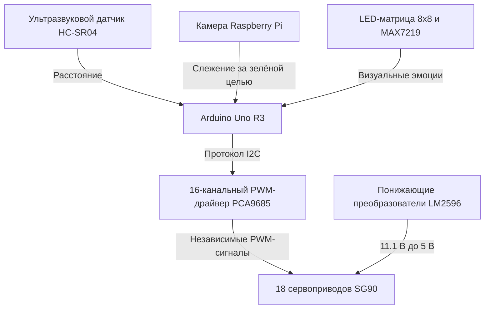

## Обзор

В отличие от колёсных платформ, шагающие роботы могут двигаться по неровной поверхности и переступать препятствия. Для согласованной работы многих конечностей нужны точное управление приводами, устойчивая кинематика и надёжная система питания.

В выпускном инженерном проекте разработан **автономный гексапод с 18 степенями свободы**. Корпус состоит из напечатанных на 3D-принтере деталей, управление построено на Arduino Uno R3 и PWM-драйвере PCA9685. Робот устойчиво ходит, обходит препятствия в реальном времени и отслеживает цель с помощью компьютерного зрения.

---

## Архитектура системы

Управление распределено между несколькими аппаратными модулями:

- **Кинематика:** Arduino Uno R3 формирует походку и опрашивает датчики. Через I2C-драйвер PCA9685 плата управляет 18 микросервоприводами SG90, по три сустава на каждую ногу.
- **Восприятие:** HC-SR04 измеряет расстояние для навигации и обхода препятствий. Камера Raspberry Pi отслеживает зелёную метку.
- **Интерфейс:** LED-матрица 8x8 с контроллером MAX7219 показывает пиктограммы, отражающие состояние робота, например радость, грусть или поиск.

### Электрическая схема

Схема показывает распределение питания, подключение 18 сервоприводов к PCA9685 и связь с Arduino Uno:

---

## Ключевые детали реализации

### 1. Конечный автомат для походки «трипод»

Для ходьбы 18 суставов должны двигаться согласованно и сохранять баланс. Ноги разделены на две чередующиеся группы по три: 1, 3, 5 и 2, 4, 6.

- **Фазы переноса и опоры:** одна группа поднимается и движется вперёд, а другая остаётся на земле и толкает корпус. Центр массы остаётся внутри устойчивого треугольника опоры.
- **Оптимизация памяти:** большие таблицы траекторий переполняли 2 КБ SRAM Arduino Uno. Статические углы походки перенесены во флеш-память с помощью `PROGMEM`.

### 2. Силовая схема для больших токов

Средний ток SG90 невелик, но при одновременном запуске или подъёме ног каждый привод может кратковременно потреблять до 800 мА. Для 18 приводов пик превышает 10 А и может повредить обычные стабилизаторы.

- **Понижение напряжения:** отдельная плата с LM2596 преобразует 11,1 В аккумулятора LiPo в стабильные 5 В и распределяет нагрузку по сегментам до 3 А.
- **Развязывающие конденсаторы:** электролитические конденсаторы сглаживают пики тока и предотвращают перезапуск контроллера.

---

## Технические проблемы и решения

1. **Перегрев преобразователей питания сервоприводов:** миниатюрные преобразователи отключались из-за токовой перегрузки, вызванной сопротивлением в шарнирах.
   - *Решение:* более мощные LM2596, отдельные линии нагрузки и радиаторы.
2. **Скольжение ног:** пластиковые наконечники плохо держались на гладком полу, особенно при поворотах.
   - *Решение:* резиновые накладки на концах ног увеличили сцепление.
3. **Повреждение PCA9685:** обратная ЭДС приводов создавала выбросы напряжения и повреждала выходы драйвера.
   - *Решение:* P-канальные MOSFET-ключи обеспечили защиту от обратной полярности и перегрузки.

---

## Демонстрационное видео

Видео показывает ходьбу робота, отображение эмоций и слежение за зелёной меткой:

  <iframe
    src="https://www.youtube.com/embed/ncwSMs6z5Ug"
    title="Испытание гексапода с 18 степенями свободы"
    frameborder="0"
    allow="accelerometer; autoplay; clipboard-write; encrypted-media; gyroscope; picture-in-picture; web-share"
    allowfullscreen
    style="position: absolute; top: 0; left: 0; width: 100%; height: 100%;"
  ></iframe>

