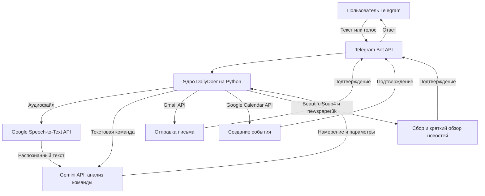

## Обзор

Работа с календарём, электронной почтой и ежедневными новостями в разных приложениях занимает много времени. **DailyDoer Agent** объединяет эти задачи в одном чате Telegram.

Бот использует Google Gemini API, понимает текстовые и голосовые сообщения и может создавать события, отправлять письма, расшифровывать аудио и кратко пересказывать веб статьи.

---

## Архитектура системы

---

## Основные функции и интеграции

### 1. Анализ команд на естественном языке

- **Google Gemini (`gemini-1.5-flash-latest`)** определяет намерение пользователя без отдельного обучения. Обычная фраза, например *«Назначь встречу с командой завтра в 14:00»*, преобразуется в структурированный запрос с адресатами, датой и описанием события.

### 2. Распознавание голосовых команд

- **Google Cloud Speech-to-Text API** через `google-cloud-speech` расшифровывает голосовые сообщения. Полученный текст сразу передаётся модулю анализа команд.

### 3. Автоматизация Google Workspace

- **Календарь:** Google Calendar API получает список событий, проверяет конфликты и создаёт новые события с заданным временем начала и окончания.
- **Электронная почта:** Gmail API создаёт и отправляет письма через безопасную авторизацию OAuth2 с файлами `credentials.json` и `token.json`.

### 4. Сбор и краткий обзор новостей

- **`newspaper3k`** и **`httpx`** извлекают основной текст по ссылкам пользователя.
- **BeautifulSoup4** собирает ссылки с заранее выбранных новостных сайтов. Gemini сокращает материалы и формирует ежедневный обзор.

---

## Технические задачи и решения

1. **Нестабильная структура сайтов:** HTML новостных страниц часто меняется, поэтому CSS селекторы BeautifulSoup4 перестают работать.
   - *Решение:* основной текст извлекается устойчивыми правилами `newspaper3k`, а BeautifulSoup4 отвечает только за лёгкий сбор ссылок с главной страницы.
2. **Безопасная работа с токенами:** доступ Gmail и Google Calendar должен обновляться без постоянной ручной авторизации.
   - *Решение:* локальное хранилище `token.json` автоматически обновляет токены и просит повторный вход только после истечения срока или отзыва доступа.

---

## Репозиторий GitHub

Инструкции по установке, настройке доступа и исходный код Python доступны на GitHub:
👉 [AlexL71/Daily-Doer---Agent](https://github.com/AlexL71/Daily-Doer---Agent)
