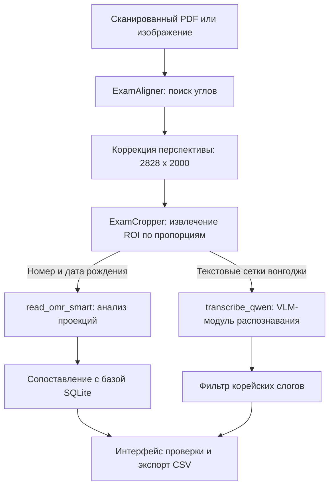

## Обзор

Оцифровка рукописных экзаменов объединяет две инженерные задачи. Точное оптическое распознавание отметок **OMR** необходимо для чтения номера студента и даты рождения, а распознавание рукописного текста **HTR** — для чтения ответов на традиционных корейских листах *вонгоджи*.

**ExamOCR** выполняет весь процесс от сканированного листа до сохранённого результата. Система сочетает коррекцию перспективы, обрезку сеток по проекциям и визуально-языковую модель (VLM) Qwen2.5-VL-7B-Instruct в административном интерфейсе Streamlit.

---

## Архитектура системы



Приложение разделено на независимые уровни:

1. **Интерфейс:** панель Streamlit для многоязычной проверки, разметки на холсте и экспорта CSV.
2. **Хранилище:** база SQLite (`database.py`) с данными студентов, оценками, состоянием холста и распознанным текстом.
3. **Выравнивание и обрезка:** алгоритмы `utils/alignment.py` и `utils/cropping.py`.
4. **Распознавание ячеек OMR:** проекционный анализ синхронизирующих меток в `utils/detection.py`.
5. **Распознавание HTR:** генерация последовательности Qwen2.5-VL на GPU в `utils/recognition.py`.

---

## Изменение подхода: детерминированное выравнивание вместо поиска контуров

Первые прототипы пытались находить каждое поле и каждую ячейку по её контуру. В реальных сканах карандашные отметки, пересечения с рукописным текстом и складки листа разрушали границы и смещали выравнивание.

Поэтому система была перестроена вокруг **детерминированного выравнивания и анализа проекций**.

### 1. Коррекция перспективы по угловым меткам

Вместо поиска отдельных полей система находит четыре чёрные квадратные или прямоугольные метки на полях листа.

- **Поиск меток:** каждый локальный квадрант (`0:cy, 0:cx` и другие) проверяется по площади контура $50 < \text{Area} < 5000$ и отношению ширины к высоте от $0,7$ до $1,3$.

- **Преобразование:** четыре координаты переносятся в фиксированное пространство $2828 \times 2000$ пикселей с помощью матрицы перспективы:

```python
src = np.array([tl, tr, br, bl], dtype="float32")
dst = np.array([[0, 0], [temp_w, 0], [temp_w, temp_h], [0, temp_h]], dtype="float32")
warped = cv2.warpPerspective(img, cv2.getPerspectiveTransform(src, dst), (temp_w, temp_h))
```

### 2. Обрезка по заранее заданным пропорциям

После нормализации листа области интереса извлекаются по заранее заданным относительным координатам. Динамический поиск контуров больше не требуется:
```python
ROIS_P1 = {
    'Student_ID':    {'x': (0.202, 0.518),   'y': (0.0534, 0.2051)},
    'DOB':           {'x': (0.5265, 0.719),  'y': (0.0537, 0.2044)},
    'Name':          {'x': (0.7285, 0.993),  'y': (0.0127, 0.0566)},
    'Wongoji_P1':    {'x': (0.0095, 0.993),  'y': (0.2207, 0.976)}
}
```

### 3. OMR на основе проекций синхронизирующих меток

Для чтения заполненных ячеек номера студента и даты рождения функция `read_omr_smart` вычисляет вертикальные и горизонтальные проекции бинарного изображения, то есть суммы активных пикселей по каждой оси. Границы строк и столбцов определяются по пикам и впадинам этих профилей; найденные ориентиры служат динамическими **синхронизационными метками (timing tracks)**.

- **Классификация отметки:** порог по красному каналу $I_R$ отделяет карандаш от красных линий сетки. Для каждой клетки вычисляется доля заполнения:

$$
\text{Ratio} = \frac{\text{NonZero}(I_R \le 180)}{\text{Cell Area}}
$$

Если заполнение клетки составляет $\ge 12\%$, она считается выбранной. Значения от $5\%$ до $12\%$ отмечаются как сомнительные (`!`) и направляются на ручную проверку.

---

## Фильтр корейских слогов

Границы клеток создают шум при распознавании рукописного текста, поэтому Qwen2.5-VL иногда формирует недопустимые символы.

Для постобработки разработан **лингвистический фильтр корейского языка**. Слог хангыля состоит из начальной согласной, средней гласной и необязательной конечной согласной. В диапазоне Unicode от `U+AC00` до `U+D7A3` возможно 11 172 комбинации, а стандарт **KS X 1001** включает набор из **2 350** часто используемых готовых слогов.

Фильтр обрабатывает последовательность OCR следующим образом:

1. Проверяет каждый распознанный символ.
2. Определяет, входит ли он в блок слогов хангыля.
3. Сверяет его с **2 350 классами KS X 1001**.
4. Удаляет недопустимые комбинации или заменяет их ближайшими фонетическими вариантами, чтобы ошибки не попадали в индекс базы данных.
5. Использует морфологический анализ Kiwi (`kiwipiepy`) для извлечения корректных существительных (`NNG`, `NNP`) в метаданные.
