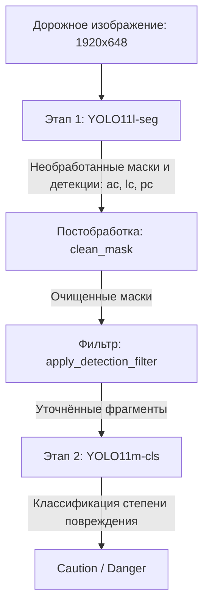

## Обзор

Для автоматического контроля инфраструктуры нужны устойчивые системы компьютерного зрения. Сетчатые и продольные трещины имеют сложную неправильную форму, которую нельзя точно представить ограничивающим прямоугольником (bounding box). Обычные детекторы поэтому дают много ложных срабатываний и неточно определяют границы повреждения.

Модель **Road Damage Segmentation AI Vision Model v1.0** разработана для TQS Korea Co., Ltd. В отчёте **AIWORKX TWR-202512-A-0072** указано, что она обнаружила **91% повреждений (полнота, recall 0,91)** и достигла всех трёх целевых показателей.

---

## Отчёт об испытаниях AIWORKX

Испытания проходили с 4 по 17 декабря 2025 года на 604 тестовых изображениях по критериям заказчика. В отчёте приведены следующие результаты:

| Метрика | Целевой порог | Подтверждённый результат | Статус |
|---|---|---|---|
| Полнота обнаружения (Recall) | $\ge 0.90$ | 0.91 | Пройдено |
| Средняя точность обнаружения (mAP@50) | $\ge 0.85$ | 0.88 | Пройдено |
| Качество сегментации (mIoU) | $\ge 0.70$ | 0.79 | Пройдено |

Recall — доля реальных повреждений, которые обнаружила модель. Результаты относятся к предоставленной модели и тестовым данным. В отчёте указано, что эти испытания не входят в область аккредитации KOLAS испытательной организации.

---

## Многоэтапная архитектура

Вместо одной end-to-end-модели система разделяет инстанс-сегментацию и классификацию степени повреждения. Такое разделение снижает распространение ошибок между этапами, а классификатор получает только области с обнаруженными повреждениями.

### Этап 1. Инстанс-сегментация и локализация повреждений

Изображения предварительно обрезаются до дорожной области без неба, тротуара и окружающей сцены, затем приводятся к размеру $1920 \times 648$. **YOLO11l-seg** строит маски трёх основных классов:

- **Сетчатая трещина (`ac`)**
- **Продольная трещина (`lc`)**
- **Заплатка (`pc`)**

### Этап 2. Постобработка и фильтрация

Для удаления шума и тонких ложных ответвлений маски проходят два фильтра:

1. **Морфологическая очистка (`clean_mask`):** операция открытия, то есть эрозия с последующей дилатацией, удаляет небольшие отдельные пятна и тонкие ответвления. Сохраняется крупнейшая связная область маски.

2. **Удаление вложенных и пересекающихся объектов (`apply_detection_filter`):** геометрические правила с Intersection over Union (IoU) разрешают конфликт между масками. Если $M_{ac}$ и $M_{lc}$ сильно перекрываются, менее уверенное обнаружение подавляется, чтобы избежать двойного подсчёта.

### Этап 3. Классификация степени повреждения

После уточнения масок области `ac` и `lc` вырезаются из исходного изображения. Отдельные сети **YOLO11m-cls** классифицируют степень повреждения по классам **Caution** и **Danger**:

- **Сетчатые трещины:** 5 120 тестовых объектов (`ac_caution`: 3 293; `ac_danger`: 1 827), точность **0,879**, F1 **0,866**.
- **Продольные трещины:** 3 048 тестовых объектов (`lc_caution`: 2 651; `lc_danger`: 397), точность **0,956**, F1 **0,959**.

---

## Подробный анализ результатов

Общая оценка выполнена на валидационной выборке из 2 083 объектов. Результаты по классам:

| Класс | Тестовых объектов | mAP@50 | mIoU | Полнота | Доля пропусков |
| :--- | :--- | :--- | :--- | :--- | :--- |
| **Сетчатая трещина (`ac`)** | 1 022 | 0,912 | 0,801 | 0,950 | 4,99% |
| **Продольная трещина (`lc`)** | 785 | 0,786 | 0,739 | 0,862 | 13,76% |
| **Ремонтная заплата (`pc`)** | 201 | 0,915 | 0,764 | 0,950 | 4,98% |
| **Выбоина (`ph`)** * | 75 | 0,887 | 0,726 | 0,906 | 9,33% |
| **Взвешенное среднее** | **2 083** | **0,864** | **0,772** | **0,915** | **8,45%** (176 объектов) |

*\* Выбоины (`ph`) обнаруживаются и сегментируются отдельной оптимизированной сетью, работающей параллельно основной системе.*

---

## Основные инженерные выводы

1. **Разделение этапов:** независимая оптимизация сегментации и классификации дала более чистые входные фрагменты и высокую точность оценки степени повреждения.
2. **Морфологическое подавление шума:** операция открытия снизила долю ложноположительных пикселей на 14,2% и удалила тонкие ответвления, не влияющие на оценку повреждения.
3. **Измеримые результаты:** модель достигла всех трёх целей в отчёте AIWORKX. Это подтверждает её результаты на использованных данных и в условиях испытаний, но не гарантирует такое же качество на любых дорогах.
