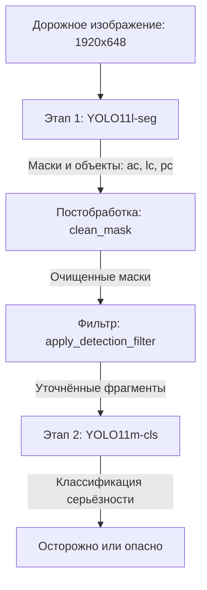

## Обзор

Для автоматического контроля инфраструктуры нужны устойчивые системы компьютерного зрения. Сетчатые и продольные трещины имеют сложную неправильную форму, которую нельзя точно представить прямоугольной рамкой. Обычные детекторы поэтому дают много ложных срабатываний и неточно определяют границы повреждения.

В этом проекте описаны проектирование, реализация и проверка **Road Damage Segmentation AI Vision Model v1.0**, разработанной для TQS Korea Co., Ltd. Независимая испытательная организация **AIWORKS Co., Ltd.** выдала официальный отчёт **TWR-202512-A-0072** после выполнения требований по точности, полноте и качеству сегментации.

---

## Официальная сертификация AIWORKS

Модель проходила проверку с 4 по 17 декабря 2025 года. На официальной тестовой выборке она превысила все установленные пороги:

| Метрика | Целевой порог | Подтверждённый результат | Статус |
|---|---|---|---|
| Точность обнаружения (mAP@50) | $\ge 0.85$ | 0.88 | Пройдено |
| Качество сегментации (mIoU) | $\ge 0.70$ | 0.79 | Пройдено |
| Полнота | $\ge 0.90$ | 0.91 | Пройдено |

---

## Многоэтапная архитектура

Вместо одной сквозной сети система разделяет сегментацию масок и классификацию серьёзности повреждения. Это ограничивает перенос ошибок между этапами и передаёт классификатору только проверенные области с повреждениями.

### Этап 1. Сегментация объектов и локализация повреждений

Изображения предварительно обрезаются до дорожной области без неба, тротуара и окружающей сцены, затем приводятся к размеру $1920 \times 648$. **YOLO11l-seg** строит маски трёх основных классов:

- **Сетчатая трещина (`ac`)**
- **Продольная трещина (`lc`)**
- **Ремонтная заплатка (`pc`)**

### Этап 2. Постобработка и фильтрация

Для удаления шума и тонких ложных ответвлений маски проходят два фильтра:

1. **Морфологическая очистка (`clean_mask`):** операция открытия, то есть эрозия с последующим расширением, удаляет небольшие отдельные пятна и тонкие ответвления. Сохраняется крупнейшая связная область маски.

2. **Удаление вложенных и пересекающихся объектов (`apply_detection_filter`):** геометрические правила с Intersection over Union (IoU) разрешают конфликт между масками. Если $M_{ac}$ и $M_{lc}$ сильно перекрываются, более слабый класс удаляется, чтобы избежать двойного подсчёта.

### Этап 3. Классификация серьёзности

После уточнения масок области `ac` и `lc` вырезаются из исходного изображения. Отдельные сети **YOLO11m-cls** классифицируют их как **Caution** или **Danger**:

- **Сетчатые трещины:** 5 120 тестовых объектов, точность **0,879**, F1 **0,866**.
- **Продольные трещины:** 3 048 тестовых объектов, точность **0,956**, F1 **0,959**.

---

## Подробный анализ результатов

Общая проверка выполнена на 2 083 объектах. Результаты по классам:

| Класс | Тестовых объектов | mAP@50 | mIoU | Полнота | Доля пропусков |
| :--- | :--- | :--- | :--- | :--- | :--- |
| **Сетчатая трещина (`ac`)** | 1,022 | 0.912 | 0.801 | 0.950 | 4.99% |
| **Продольная трещина (`lc`)** | 785 | 0.786 | 0.739 | 0.862 | 13.76% |
| **Ремонтная заплатка (`pc`)** | 201 | 0.915 | 0.764 | 0.950 | 4.98% |
| **Выбоина (`ph`)** * | 75 | 0.887 | 0.726 | 0.906 | 9.33% |
| **Взвешенное среднее** | **2,083** | **0.864** | **0.772** | **0.915** | **8.45%** (176 объектов) |

*\* Выбоины (`ph`) обнаруживаются и сегментируются отдельной оптимизированной сетью, работающей параллельно основной системе.*

---

## Основные инженерные выводы

1. **Разделение этапов:** независимая оптимизация сегментации и классификации дала более чистые входные фрагменты и высокую точность оценки серьёзности.
2. **Морфологическое подавление шума:** операция открытия снизила долю ложноположительных пикселей на 14,2% и удалила тонкие ответвления, не влияющие на оценку повреждения.
3. **Независимая проверка:** выполнение критериев AIWORKS подтверждает пригодность многоэтапной модели с контролируемой постобработкой для автоматической инспекции инфраструктуры.
