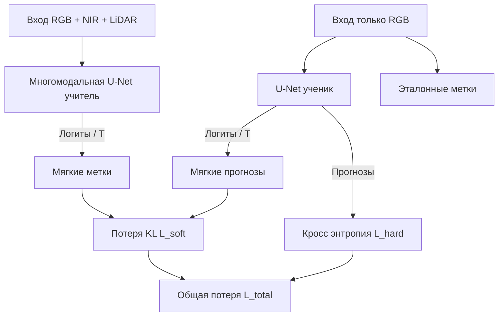

## Обзор

Точная сегментация городской растительности важна для планирования и экологического управления. Лучшие системы используют сложные и дорогие источники данных: RGB, ближний инфракрасный диапазон (NIR) и LiDAR. Такое объединение повышает точность, но сбор, совмещение и обработка всех модальностей затрудняют практическое применение.

В исследовании используется **межмодальная дистилляция знаний**. Сначала обучается семиканальная U-Net **учитель** на RGB, NIR и LiDAR. Затем её пространственные знания передаются облегчённой трёхканальной U-Net **ученику**, которая использует только RGB.

## Опубликованная статья

Работа, написанная совместно с **Seohoon Jin**, опубликована под названием [**“Efficient Semantic Segmentation: Leveraging Knowledge Distillation for Modality Reduction”**](https://doi.org/10.1109/AEECA65693.2025.00147) в материалах **2025 International Conference on Advances in Electrical Engineering and Computer Applications (AEECA)**. Конференция проходила в Даляне, Китай, с 22 по 24 августа 2025 года. Статья добавлена в IEEE Xplore 19 января 2026 года.

[Посмотреть публикацию в IEEE Xplore](https://ieeexplore.ieee.org/document/11327683)

---

## Данные и модальности

Система обучалась и проверялась на городском поднаборе многоканальных данных растительности от **Korea National Geographic Information Institute (NGII)** и программы **NASA GEDI (2022)**:

- **Объём:** 132 000 ортотрансформированных фрагментов GeoTIFF.
- **Размер:** $512 \times 512$ пикселей при пространственном разрешении $10\text{ см}$.
- **Вход учителя:** 7 совмещённых каналов: 3 RGB, 3 NIR и 1 канал высоты растительного покрова из LiDAR. Все значения нормализованы в диапазон $[0, 1]$.
- **Вход ученика:** 3 канала RGB.
- **Классы:** хвойные деревья, лиственные деревья, нелесная территория, уличные деревья, травянистая растительность и кустарники. Уличные деревья и кустарники занимают менее 3% пикселей каждый.

---

## Процесс дистилляции знаний

Ученик минимизирует взвешенную сумму обычной кросс энтропии по эталонным меткам и дивергенции Кульбака — Лейблера (KL) между смягчёнными выходами учителя и ученика:

### Функция потерь

Общая функция сочетает кросс энтропию по эталонным классам и KL дивергенцию по смягчённым логитам. Коэффициент $\alpha = 0,5$ придаёт одинаковый вес эталонной разметке и знаниям учителя.

Перед softmax распределения учителя и ученика масштабируются температурой $T = 3$. Более мягкое распределение сохраняет информацию о сходстве классов и помогает ученику распознавать тонкие пространственные границы, например переход между кустарником и травой.

---

## Результаты эксперимента

Четыре варианта оценивались в одинаковых условиях без аугментации, с оптимизатором Adam и скоростью обучения $1 \times 10^{-4}$.

### Сравнение mIoU и F1

| Модель | Входные модальности | mIoU | Macro F1 | Закрытая разница |
| :--- | :--- | :--- | :--- | :--- |
| **Учитель** | RGB + NIR + LiDAR, 7 каналов | **0.7132** | **0.8253** | — |
| **Ученик после дистилляции** | Только RGB, 3 канала | **0.6002** | **0.7342** | **62.8% разницы** |
| **Базовая RGB модель** | Только RGB, 3 канала | 0.4091 | 0.5206 | — |
| **Базовая NIR модель** | Только NIR, 3 канала | 0.5044 | 0.6366 | — |

Ученик достигает **0,6002 mIoU** и закрывает **62,8%** разницы между базовой RGB моделью и многомодальным учителем. При этом число типов входных данных и сложность обработки значительно уменьшаются.

### mIoU по классам

| Класс | Учитель, 7 каналов | Ученик, RGB | Базовая RGB | Улучшение |
| :--- | :--- | :--- | :--- | :--- |
| Хвойные деревья | 0.5717 | 0.4725 | 0.1447 | **3.26x** |
| Лиственные деревья | 0.7500 | 0.6488 | 0.5120 | **1.26x** |
| Нелесная территория | 0.9512 | 0.9164 | 0.8928 | **Стабильно** |
| Уличные деревья | 0.5945 | 0.4788 | 0.2547 | **1.88x** |
| Травянистая растительность | 0.8111 | 0.7177 | 0.6016 | **1.19x** |
| **Кустарники** | 0.6008 | 0.3671 | 0.0491 | **7.47x** |

### Основные выводы

1. **Улучшение редких классов:** наибольший прирост получен для кустарников и уличных деревьев. mIoU кустарников вырос в **7,47 раза** относительно базовой RGB модели.
2. **Упрощённое применение:** ученику нужны только обычные RGB изображения, поэтому при работе системы не требуется устанавливать и калибровать NIR и LiDAR датчики.
