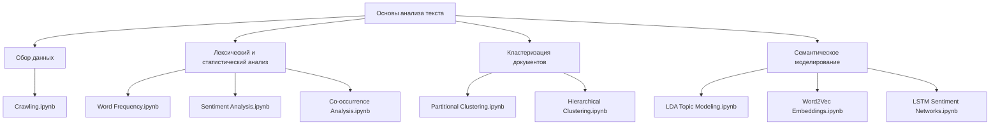

## Обзор

Анализ текста связывает неструктурированные документы со статистикой и прогнозными моделями. Студентам часто мешают сложная настройка окружения и резкий переход от матриц TF-IDF к последовательным представлениям глубокого обучения.

Для учебных занятий в департаменте Big Data Science **Университета Корё** я подготовил курс **«Основы анализа текста с Python»**. Он состоит из 11 практических Jupyter Notebook, которые последовательно охватывают весь процесс анализа текста. В качестве основы использовался корейский учебник *«잡아라! 텍스트마이닝 with 파이썬»*.

---

## Структура курса

Каждая тема оформлена как отдельный самостоятельный ноутбук в репозитории проекта:



### Учебные модули

1. **Автоматический сбор (`Crawling.ipynb`):** HTTP запросы и разбор HTML с BeautifulSoup и requests.
2. **Частотный анализ (`Word Frequency Analysis.ipynb`):** токенизация, удаление стоп слов и визуализация частот с NLTK и Matplotlib.
3. **Словарный анализ тональности:** AFINN и собственные словари.
4. **Совместная встречаемость:** матрицы совместной встречаемости и семантические сети NetworkX.
5. **Сходство текстов:** веса TF-IDF и матрицы косинусного сходства.
6. **Кластеризация документов:** K-Means и агломеративная иерархическая кластеризация в Scikit-Learn и Scipy.
7. **Word2Vec:** обучение моделей CBOW и skip-gram в Gensim.
8. **Тематическое моделирование LDA:** поиск скрытых тематических смесей в коллекции документов.
9. **Последовательное глубокое обучение:** рекуррентная сеть LSTM в TensorFlow и Keras для классификации тональности.

---

## Воспроизводимое окружение

Чтобы ноутбуки одинаково работали на компьютерах студентов, курс задаёт единый порядок настройки окружения.

### Настройка Conda

Студенты создают отдельное виртуальное окружение с фиксированной версией Python:

```bash
# 1. Создать чистое виртуальное окружение
conda create -n textmining python=3.9 -y

# 2. Активировать окружение
conda activate textmining

# 3. Установить Jupyter и поддержку ядер
pip install ipykernel notebook

# 4. Зарегистрировать отдельное ядро Jupyter
python -m ipykernel install --user --name textmining --display-name "Python (textmining)"
```

### Необходимые зависимости

Файл `requirements.txt` фиксирует основные библиотеки:

- **Обработка данных:** `numpy`, `pandas`, `scipy`
- **Визуализация:** `matplotlib`, `seaborn`, `wordcloud`
- **Машинное обучение:** `scikit-learn`, `pyclustering`, `networkx`
- **Анализ текста:** `nltk`, `gensim`, `afinn`
- **Глубокое обучение:** `tensorflow`
- **Сбор данных:** `beautifulsoup4`, `requests`
- **Корейский язык:** `kiwipiepy`, морфологический анализатор Kiwi
